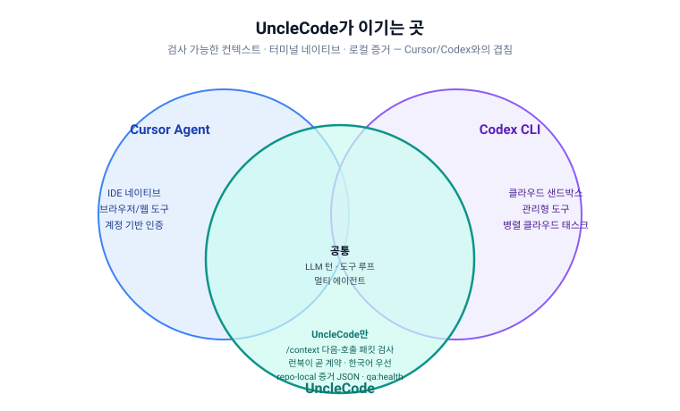
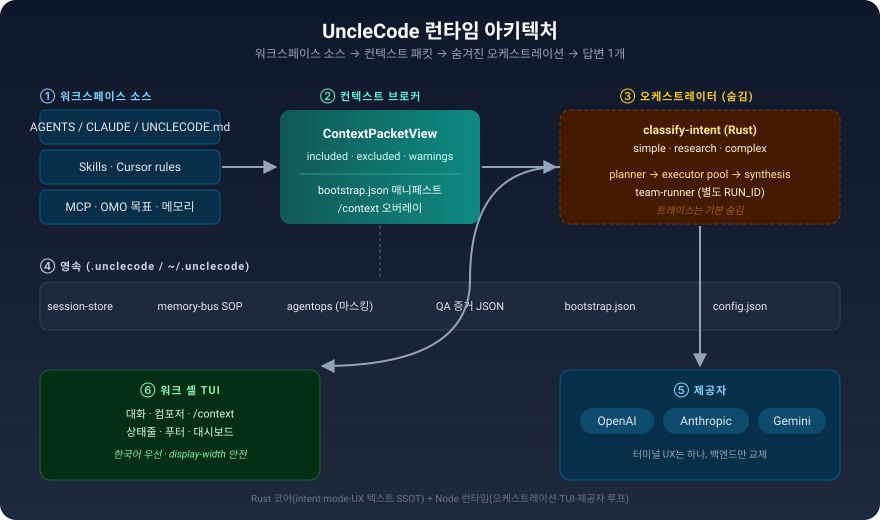
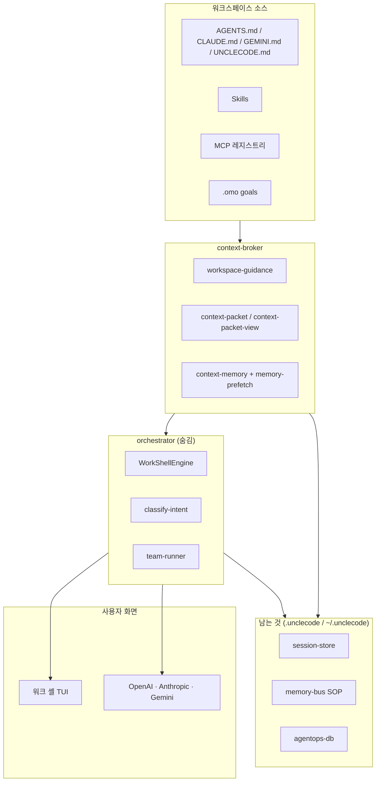
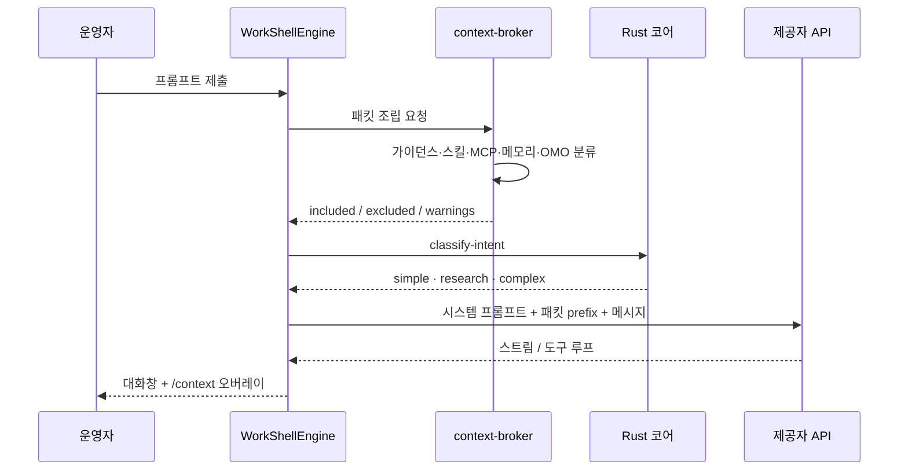
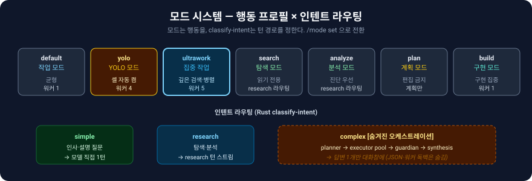
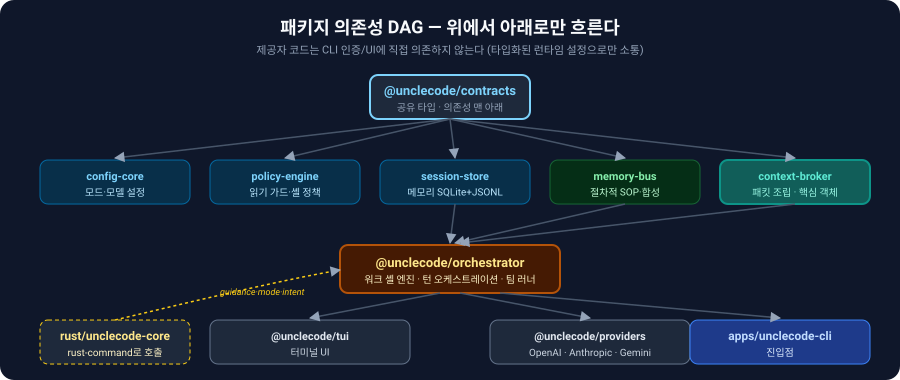

<div align="center">

# UncleCode

**저장소 안에서 동작하는 코딭 셸.** 모델이 무엇을 보는지 열어 보여주고, 복잡한 작업은 뒤에서 조용히 처리한다.

[빠른 시작](#빠른-시작) · [철학](#철학) · [아키텍처](#아키텍처) · [모드](#모드-시스템) · [문서](#문서)

</div>

---

<div align="center">

| OpenAI | Anthropic | Gemini | Rust 코어 | 한국어 우선 |
|:---:|:---:|:---:|:---:|:---:|
| ✅ | ✅ | ✅ | ✅ | ✅ |

</div>

UncleCode는 그냥 "채팅 터미널"이 아니다. 다음 모델 호출에 실릴 **패킷**을 운영자가 직접 열어 보고, 고치고, 믿을 수 있게 만드는 게 핵심이다. 모드와 인텐트, 병렬 워커는 뒤에서 조용히 돌아가고 화면에는 다듬어진 답변 하나만 남는다. OpenAI·Anthropic·Gemini 세 백엔드를 한 화면에서 쓰면서, 컨텍스트와 증거는 저장소 안(`.unclecode/`)에 남긴다.

<div align="center">

| 차별점 | 설명 |
|:---|:---|
| 🔍 **들여다볼 수 있는 컨텍스트** | 모델이 무엇을 보는지 `/context`로 연다. 빠진 항목엔 이유가 붙는다 |
| 🤫 **숨겨진 오케스트레이션** | 복잡한 턴은 뒤에서 쪼개지고, 답변 하나만 남는다 |
| 🏠 **저장소 안에 남는 기억** | `.unclecode/`에 세션·메모리·증거가 쌓인다. 매 턴 처음부터 안 읽는다 |

</div>

---

## 빠른 시작

```bash
npm install
cargo build --workspace
npm run unclecode          # 세션 센터 TUI + 운영 셸
npm run unclecode -- work  # 인터랙티브 코딩 워크 셸
```

워크 셸이 켜지면 제공자(OpenAI / Anthropic / Gemini)를 고르고 자격 증명을 넣는다. 키가 없으면 자리에서 물어본다.

### 기본 코드 지능 도구

Pi 작업 엔진은 셸 권한과 별개로 다음 도구를 기본 등록한다. `/tools`에서 현재 메타데이터와 위험도를 확인할 수 있다.

| 도구 | 동작 |
| --- | --- |
| `lsp_query` | 진단, 정의, 참조, hover, 문서 심볼을 언어 서버에 질의 |
| `lsp_rename` | 언어 서버가 반환한 워크스페이스 편집을 검증한 뒤 심볼 이름 변경 |
| `ast_search` | `ast-grep` 패턴으로 구문 구조 검색 |
| `ast_rewrite` | AST 치환 미리보기 또는 확인 후 일괄 적용 |

LSP는 TypeScript/JavaScript(`typescript-language-server`), Rust(`rust-analyzer`), Python(`pyright-langserver`), Go(`gopls`)를 자동 선택한다. 실행 파일은 `UNCLECODE_TYPESCRIPT_LANGUAGE_SERVER`, `UNCLECODE_RUST_ANALYZER`, `UNCLECODE_PYRIGHT_LANGUAGE_SERVER`, `UNCLECODE_GOPLS`로 재정의할 수 있다. AST 도구는 `ast-grep` 실행 파일이 `PATH`에 있어야 하며 `UNCLECODE_AST_GREP`으로 경로를 재정의할 수 있다. `lsp_rename`과 적용 모드의 `ast_rewrite`는 쓰기 승인 대상으로 표시된다.


> **왜 이 도구인가?** Cursor·Codex·OMP·Senpi·Prime Agent도 강한 코드 도구와 에이전트 실행을 제공한다. UncleCode의 차이는 우열을 주장하는 기능표가 아니라, **다음 모델 호출에 들어갈 로컬 컨텍스트 패킷을 열어 보고 조절하며 그 근거를 저장소에 남기는 운영 경계**다.

---

## 철학

이 절은 UncleCode의 정체성을 정의한다. 코드가 바뀌어도 아래 다섯 가지는 지켜져야 한다.

### 1. 들여다볼 수 있는 컨텍스트

대부분의 코딩 CLI는 매 프롬프트를 떨어진 채팅 한 턴으로 다룬다. 모델이 무슨 문맥을 보았는지 운영자가 검사할 길이 없다.

UncleCode의 핵심 객체는 **다음 모델 호출에 실릴 패킷**이다. 가이던스·스킬·MCP·메모리·OMO 목표가 한 패킷으로 모이고, `/context` 오버레이로 **들어간 것·빠진 것·경고**를 한눈에 본다. 빠진 항목에는 반드시 이유가 붙는다. 까만 상자 요약이 아니라 감사할 수 있는 투명성이다.

> 패킷에 들어간 항목은 왜 들어갔는지, 빠진 항목은 왜 빠졌는지 이유가 있어야 한다.
> — `docs/design/persistent-context-architecture.md` 설계 원칙 #1

### 2. 숨겨진 오케스트레이션

복잡한 턴은 보이지 않게 쪼개진다. planner → executor pool → guardian(선택) → synthesis를 거쳐 **다듬어진 답변 하나**만 대화창에 남는다. 서브태스크 JSON, 워커 독백, 도구 트레이스는 기본으로 숨겨지고, 필요할 때만 `/verbose`나 세션 센터 트레이스로 꺼낸다.

이게 Fable-5 방식의 오케스트레이션이다. 전략을 짜는 planner는 보이지 않고, 운영자는 결과만 본다.

### 3. 한국어 우선 운영 화면 (목표)

UncleCode는 한국어 운영자를 1급 사용자로 둔다. 모드 칩, 상태줄·푸터, `/mode` 설명, 읽기 전용 가드 메시지를 한국어로 통일하는 게 목표다. 안쪽 모드 id(`default`, `ultrawork`, `plan`…)는 설정과 테스트를 위해 영어로 고정한다.

**현재 상태:** 상태줄·푸터와 Rust CLI는 `rust/unclecode-core/src/mode.rs`의 `mode_label`을 공유한다. TUI 푸터는 Rust `ux text mode-label` 경로를 호출하므로 TypeScript에 별도 모드 라벨 맵이 없다. 내부 id는 그대로 설정·테스트용 영어다.

| 내부 id | 표시 라벨 |
| --- | --- |
| `default` | 작업 모드 |
| `ultrawork` | 집중 작업 모드 |
| `yolo` | YOLO 모드 |
| `search` | 탐색 모드 |
| `analyze` | 분석 모드 |
| `plan` | 계획 모드 |
| `build` | 구현 모드 |

한국어·CJK·이모지 폭 글리프와 박스 문자는 표시 너비 계산의 1급 시민이다(이쪽은 이미 코드에 반영됐다). 레이아웃 계산은 항상 표시 너비를 쓰고, 문자열 길이를 쓰지 않는다.

### 4. 저장소 안에 남는 기억

`.unclecode/`(프로젝트)와 `~/.unclecode/`(사용자)가 공유 컨텍스트의 보금자리다. 매 턴 처음부터 다시 읽지 않는다. bootstrap → classify → packet 흐름으로 재사용한다. 세션 스토어, 메모리 SOP, agentops 증거, QA JSON이 여기에 쌓인다.

### 5. 런북이 곧 계약

[`docs/runbooks/unclecode-normalization-runbook.md`](docs/runbooks/unclecode-normalization-runbook.md)가 운영의 단일 진실 원천(SSOT)이다. 패킷 규칙, QA 게이트, 모드 행동, 알려진 이슈가 코드와 함께 살아 있다. 문서와 코드가 따로 놀면 런북이 경고한다.

---

## 다른 점



| 차별점 | 설명 |
| --- | --- |
| **공유 컨텍스트가 저장소에 남는다** | 프로젝트·세션·메모리·런북·QA 증거가 `.unclecode/`와 `~/.unclecode/state/`에 쌓인다. 매 턴 처음부터 읽지 않고 bootstrap → classify → packet 흐름으로 재사용한다. |
| **런북이 지시하는 에이전트 메모리** | `packages/memory-bus`의 절차적 SOP(`.unclecode/sop/`)와 `context-broker`의 범위 메모리가 런북 규칙에 따라 들어가고 빠지고 인용된다. 까만 상자 요약이 아니다. |
| **오케스트레이션은 숨기고, TUI는 다듬는다** | 모드 라우터와 인텐트 분류는 Rust 오케스트레이터에서 처리하고, 워크 셸 TUI는 대화·컴포저·`/context` 오버레이만 보여준다. 백그라운드 워커와 팀 레인은 운영자에게 소음 없이 돌아간다. |
| **터미널 네이티브, 한국어 우선** | 운영자 화면은 한국어, 디자인은 "정돈된 종이 위 잉크" — 기본은 조용하고, 차가운 슬레이트 테두리, 절제된 teal/sky 악센트. |

<div align="center">

| ✅ UncleCode가 이기는 곳 | ❌ 아직 지는 곳 |
|:---|:---|
| 터미널 네이티브 · 제공자 무관 | 기본 온보딩 마찰 (Rust + Node 빌드) |
| 들여다볼 수 있는 컨텍스트 | 인증 상태 파편화 (OAuth vs API key) |
| 로컬 증거 JSON → CI 연동 | Cursor rules 미흡 |
| `qa:health` 회귀 게이트 | 브라우저·IDE UI·MCP 도구는 별도 조립 |

</div>

---

## 아키텍처



Rust 코어(`rust/unclecode-core`)는 인텐트 분류·모드·컨텍스트 가이던스·UX 텍스트·토큰 예산을 단일 진실 원천으로 처리하고, Node 런타임은 오케스트레이션·TUI·제공자 루프를 맡는다.

### 런타임 흐름



### 컨텍스트 부트스트랩 — 한 번의 턴

세션이 시작되면 UncleCode는 워크스페이스 소스를 모아 **다음 호출 패킷**을 만든다. 각 단계마다 이유가 기록된다.



1. **수집** — `AGENTS.md`, `CLAUDE.md`, `GEMINI.md`, `UNCLECODE.md`, 프로젝트 스킬, MCP 레지스트리, 범위 메모리, OMO 목표 상태
2. **분류** — `ContextPacketView`에 included / excluded / warnings로 나눈다(raw ledger·증거는 기본 제외)
3. **표시** — `/context` 오버레이 + 모델 prefix (`formatContextPacketPromptPrefix`)
4. **남기기** — session-store, memory-bus SOP, agentops 레코더, `.unclecode/qa/` 증거, `.unclecode/context/bootstrap.json` 매니페스트

상세 다이어그램: [`docs/design/persistent-context-architecture.md`](docs/design/persistent-context-architecture.md)

---

## 모드 시스템



모드는 **행동 프로필**이고, 인텐트 분류는 **턴 라우팅**이다. 운영자는 푸터에서 모드를 보고 `/mode set`으로 바꾼다.

| 모드 | 역할 | 편집 | 셸 자동 | 워커 |
| --- | --- | --- | --- | --- |
| `default` (작업 모드) | 균형 잡힌 편집·검색·설명 | 허용 | 게이트 | 1 |
| `yolo` (YOLO 모드) | 셸 자동 실행, 간결한 응답 | 허용 | **켬** | 최대 4 |
| `ultrawork` (집중 작업 모드) | 깊은 검색, 백그라운드·병렬 선호 | 허용 | **켬** | 최대 5 |
| `search` (탐색 모드) | 읽기 전용, research 라우팅 | **금지** | 게이트 | 3 |
| `analyze` (분석 모드) | 진단 우선 | 검토 | 게이트 | 3 |
| `plan` (계획 모드) | 편집 없이 계획만 | **금지** | 게이트 | 1 |
| `build` (구현 모드) | 구현에 집중 | 허용 | 게이트 | 1 |

프롬프트는 Rust `classify-intent`로 simple / complex / research로 갈린다. 복잡한 턴은 bounded executor pool과 파일 소유권(file-ownership)으로 병렬 처리된다. 인사말이나 "병렬 모드가 뭐야" 같은 설명 질문은 ultrawork에서도 simple 경로로 한 번에 답한다.

팀 모드(`team run --lanes N`)는 별도 RUN_ID로 coordinator/worker 레인을 띄우는 두 번째 다중 에이전트 표면이다. 기본 워크 셸 경로가 아니다.

---

## 패키지 구조

UncleCode는 안정화 단계에서 아래 DAG를 지킨다. 화살표는 위에서 아래로만 흐른다 — 순환 의존성이 없다.



```
contracts
  → config-core, policy-engine, session-store, memory-bus, context-broker
    → orchestrator
      → tui, providers
        → apps/unclecode-cli
rust/unclecode-core ← rust-command로 호출 (guidance, mode, intent, token budget)
```

| 패키지 | 책임 |
| --- | --- |
| `@unclecode/contracts` | 공유 타입·계약. 의존성의 맨 아래. |
| `@unclecode/config-core` | 모드·모델·런타임 설정 해석. |
| `@unclecode/policy-engine` | 읽기 전용 가드, 셸 실행 정책. |
| `@unclecode/session-store` | 프로젝트·세션·사용자 메모리(SQLite + JSONL). |
| `@unclecode/memory-bus` | 절차적 SOP(`.unclecode/sop/`), 변증법 합성. |
| `@unclecode/context-broker` | 가이던스·패킷·메모리·OMO 조립. 핵심 객체의 보금자리. |
| `@unclecode/orchestrator` | 워크 셸 엔진, 턴 오케스트레이션, 팀 러너, 에이전트. |
| `@unclecode/providers` | OpenAI·Anthropic·Gemini 제공자 추상화, OAuth, 상태. |
| `@unclecode/tui` | 워크 셸 터미널 UI(대화·컴포저·`/context`·대시보드). |
| `@unclecode/agentops-db` | 턴/런 이벤트를 논블로킹으로 기록(비밀값 마스킹). |
| `@unclecode/mcp-host` | MCP 서버 병합·관리. |
| `@unclecode/plugin-host` | 실행형 플러그인 호스트 + trust.json. |
| `@unclecode/lsp-bridge` | LSP 기반 워크스페이스 검사. |
| `@unclecode/runtime-broker` | 런타임 컨텍스트 브리징. |
| `@unclecode/snapshot-store` | 워크스페이스 스냅샷. |

제공자 코드는 CLI 인증/UI 계층에 직접 의존하지 않고, 타입화된 런타임 설정으로만 소통한다.

---

## 요구사항

- **Node.js** 22.18.0 이상, 26 미만(`.nvmrc`는 `22.22.0`). `npm run node:check`로 확인.
- **Rust 툴체인** 안정적인 최신 Cargo 권장(워크스페이스는 `edition = "2021"` 사용). `cargo build --workspace`로 빌드.
- **셸** — macOS 터미널/iTerm2, `bash`/`zsh`, Linux 터미널, Windows PowerShell/Git for Windows.
- **제공자 키** 중 하나 — `OPENAI_API_KEY` / `ANTHROPIC_API_KEY` / `GEMINI_API_KEY`.

> 오프라인 코어는 키 없이도 동작한다: 빌트인 슬래시 명령, `unclecode rust orchestrator ...`, `unclecode rust model catalog <provider>`, `unclecode rust aci read|write`(cwd 샌드박스). LLM 턴에는 실제 키가 필요하다.

---

## 설치

**macOS / Linux**

```bash
cd /path/to/unclecode
npm install
cp .env.example .env      # 선택 — 자리에서 물어본다
cargo build --workspace
```

**Windows (PowerShell)**

```powershell
cd E:\unclecode
npm install
copy .env.example .env
cargo build --workspace
```

`.env` 편집은 선택이다. UncleCode는 켜질 때 빠진 값을 자리에서 물어본다.

---

## 퀵 스타트

빌드 후 저장소 루트에서:

```bash
cargo build --workspace
npm run unclecode
```

기본 Pi 작업 엔진:

```bash
npm run unclecode -- work
```

직접 대화는 선택한 제공자와 모델을 그대로 쓴다. 작업을 위임하는 executor 턴만 OMP의 `kimi-code/k3`로 고정되며, UncleCode 환경 변수나 런타임 모델 변경으로 다른 모델에 재라우팅되지 않는다. 워크 셸에서 `/auth`를 입력하면 OMP가 발견한 전체 로그인 카탈로그를 열어 검색할 수 있다. Enter는 자격 증명을 가져오지 않고 OMP 소유의 `omp auth-broker login <provider>` 명령만 넘긴다.

레거시 네이티브 제공자 루프가 필요한 경우에만 엔진을 명시한다:

```bash
npm run unclecode -- work --engine native
```

제공자를 직접 지정:

```bash
npm run unclecode -- work --provider anthropic
npm run unclecode -- work --provider openai
npm run unclecode -- work --provider gemini
```

모델 id까지 직접 지정(기본 프롬프트 건너뜀):

```bash
npm run unclecode -- work --provider openai --model gpt-5.6-sol
npm run unclecode -- work --provider gemini --model gemini-2.5-pro
npm run unclecode -- work --provider anthropic --model claude-sonnet-4-6
```

원샷 프롬프트:

```bash
echo "이 저장소 요약해 줘" | npm run unclecode -- work
```

격리된 팀 워커를 백그라운드에서 실행:

```bash
npm run unclecode -- team run --background --isolation worktree "검증 가능한 변경 구현"
npm run unclecode -- team status <runId>
npm run unclecode -- team abort <runId>
npm run unclecode -- team restart <runId>
```

`worktree` 격리는 워커별 기준 커밋을 고정하고 변경 패치를 실행 루트에 반환한다. 백그라운드 작업은 PID와 프로세스 시작 식별자를 기록하며, `status`는 재시작 뒤에도 실행 상태를 복구하고 `abort`는 확인된 프로세스 트리를 종료한다.

워크 셸에서 제공자를 고른 뒤 모델 id를 입력한다. 엔터를 치면 기본값을 유지하고, 직접 id(예: `gpt-5.6-sol`, `gpt-5.6-terra`, `gpt-5.6-luna`)를 입력해도 된다. GPT-5.6 모델은 `none`, `low`, `medium`, `high`, `xhigh`, `max` reasoning 단계를 지원한다.

---

## 제공자와 환경 변수

### Anthropic

```env
ANTHROPIC_API_KEY=your_anthropic_api_key_here
ANTHROPIC_MODEL=claude-sonnet-4-20250514
```

번들 클라이언트의 일반 Anthropic 로그인 또는 `ANTHROPIC_API_KEY`를 쓴다.

### OpenAI

```env
OPENAI_API_KEY=your_openai_api_key_here
OPENAI_MODEL=gpt-5.6-sol
```

`OPENAI_API_KEY` 또는 UncleCode OpenAI 인증 흐름을 쓴다. `unclecode auth login --browser`로 로컬 자격 증명을 만들 수 있다. `.env.example`의 자리표시자 값은 미설정으로 본다.

### Gemini

```env
GEMINI_API_KEY=your_gemini_api_key_here
GEMINI_MODEL=gemini-2.5-flash
```

---

## MCP 통합

UncleCode는 다음에서 MCP 서버를 합친다:

- 사용자 설정: `~/.unclecode/mcp.json`
- 프로젝트 설정: `.mcp.json`

확인 명령:

```bash
node bin/unclecode.cjs mcp list
node bin/unclecode.cjs doctor
```

`scripts/run-mmbridge-mcp.mjs` 런처는 다음을 우선한다:
1. `MMBRIDGE_MCP_ENTRYPOINT`
2. 형제 저장소 빌드 `../mmbridge/packages/mcp/dist/index.js`
3. PATH의 글로벌 `mmbridge-mcp`

---

## 검증과 투명성

운영 게이트는 `npm run qa:health`다. 14개 체크를 통과해야 한다.

```bash
npm run qa:health                 # 운영 게이트
npm run qa:runtime                # 로컬 런타임·TUI QA
npm run qa:providers              # Gemini/OpenAI/Anthropic 도구 호출 계약
npm run benchmark:competitive:all # 격리 fixture 기반 4-system 공개 비교
```

런타임 증거는 `.unclecode/qa/runtime-qa-latest.json`, 제공자 계약은 `benchmarks/competitive/results/provider-conformance-local.json`, 경쟁 비교는 `benchmarks/competitive/results/latest.json`에 남는다. 비교 점수는 파일과 실행 가능한 post-check만 사용하며 인증 실패·미설치 시스템은 `blocked`/`unavailable`로 공개한다.

개발 검증:

```bash
npm run lint               # biome
npm run check              # tsc (빌드 뒤에 실행 — @unclecode/* 하위 경로 export가 dist/를 본다)
npm run build              # 빌드
npm run rust:check         # cargo check --workspace
npm run rust:test          # cargo test --workspace
npm run test               # 노드 테스트 스위트
npm run test:all           # lint + check + provenance + node + rust:check + test + rust:test
```

> `npm run check`는 빌드 결과물에 의존한다. `npm run build`를 먼저 돌려라. 그렇지 않으면 `TS2307 Cannot find module` 오류가 난다.

정규화 런북: [`docs/runbooks/unclecode-normalization-runbook.md`](docs/runbooks/unclecode-normalization-runbook.md)

---

## 솔직한 자기평가

UncleCode는 약점을 숨기지 않는다. 과설계·경쟁 격차·실패 시나리오는 공개 문서로 정리했다:

- **경쟁 스코어카드(솔직):** [`docs/design/devils-advocate-review-2026-07.md`](docs/design/devils-advocate-review-2026-07.md)
- **종합 로드맵:** [`docs/design/unclecode-holistic-roadmap-2026-07.md`](docs/design/unclecode-holistic-roadmap-2026-07.md)
- **디자인 시스템:** [`DESIGN.md`](DESIGN.md)

---

## 문서

| 주제 | 문서 |
| --- | --- |
| 운영 SSOT | [정규화 런북](docs/runbooks/unclecode-normalization-runbook.md) |
| 패킷 설계 | [영속 컨텍스트 아키텍처](docs/design/persistent-context-architecture.md) |
| 부트스트랩 갭 | [컨텍스트 부트스트랩 파이프라인](docs/design/context-bootstrap-pipeline.md) |
| 실행 계획 | [종합 로드맵 T11–T14](docs/design/unclecode-holistic-roadmap-2026-07.md) |
| 약점 분석 | [데빌스 어드보케이트 리뷰](docs/design/devils-advocate-review-2026-07.md) |
| 디자인 시스템 | [DESIGN.md](DESIGN.md) — 색·타이포·레이아웃·모션 |
| 작업 원칙 | [UNCLECODE.md](UNCLECODE.md) — 딥 워크 루프·검증 |
| Rust 브리지 | [Rust 포팅](docs/rust-porting.md) |

---

## 트러블슈팅

<details>
<summary><b>npm run unclecode 가 target/debug/unclecode 없음으로 실패</b></summary>

루트 `unclecode` npm 스크립트는 `target/debug/unclecode` Rust 바이너리를 가리킨다. 먼저 빌드하라:

```bash
cargo build --workspace
```
</details>

<details>
<summary><b>work 에서 OpenAI 인증이 안 될 때</b></summary>

- `OPENAI_API_KEY`가 설정되어 있는지, 또는
- 앞서 지원되는 `unclecode auth` 로그인을 마쳤는지 확인하라.
</details>

<details>
<summary><b>Gemini / Anthropic 이 답하지 않을 때</b></summary>

- `GEMINI_API_KEY` / `ANTHROPIC_API_KEY`가 설정되어 있는지
- 모델을 덮어썼다면(`GEMINI_MODEL` / `ANTHROPIC_MODEL`) 유효한 값인지 확인하라.
</details>

---

## 다른 사람에게 넘길 때

이 저장소를 누군가에게 넘기는 가장 짧은 길:

1. Node.js 22 이상 설치
2. Rust 툴체인 설치
3. `npm install`
4. `cargo build --workspace`
5. `npm run unclecode` 실행
6. 제공자 선택
7. 자격 증명 입력

별도의 글로벌 설치 없이 이 저장소만으로 쓸 수 있다.

---

<div align="center">

<sub>터미널 네이티브 · 제공자 무관 · 들여다볼 수 있는 컨텍스트 · 저장소 안에 남는 기억</sub>

</div>
