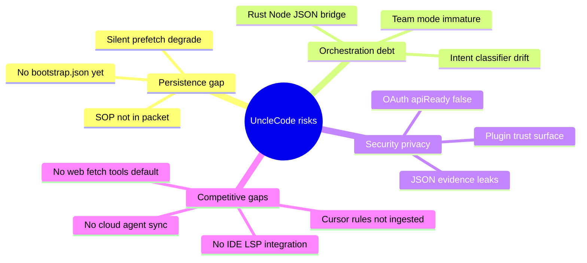

# Devil's Advocate Review — Persistent Context Architecture

> **Date:** 2026-07-05  
> **Reviewer stance:** skeptical operator, not marketing  
> **Subject:** UncleCode differentiation (`.unclecode` persistence, runbook memory, hidden orchestration, TUI)  
> **Companion:** [`persistent-context-architecture.md`](./persistent-context-architecture.md)

This document attacks the current design. The goal is to surface what breaks in production, what is over-engineered, what is missing, and where Cursor/Codex still win — before more code accretes on top.

---

## Executive summary

UncleCode's **inspectable next-call packet** is a real product thesis, and the runbook + `ContextPacketView` single-formatter discipline is stronger than most agent CLIs. But the architecture is **split-brain**: persistence is promised via `.unclecode/` while most bootstrap context is still **ephemeral live reads**; orchestration is "hidden" yet **Rust↔Node round-trips** and JSON contracts leak into every hot path; and several differentiators (Cursor rules, web tools, OAuth API-readiness, procedural SOP in bootstrap) are **designed on paper, not shipped**.

**Honest positioning:** UncleCode today is a **well-instrumented terminal work shell** with emerging context transparency — not yet a persistent-context platform that beats Cursor Agent or Codex CLI on breadth.

---

## Attack surface map

---

## Top findings (severity-ordered)

### F1 — "Persistent context" is mostly a promise, not a store

**Claim attacked:** `.unclecode/` is the canonical shared context home.

**Reality:**

- Bootstrap guidance, skills, and packet classification are **recomputed in memory** each session (`workspaceGuidanceCache`, `resolveContextPacket`). There is no `.unclecode/context/bootstrap.json` in production yet (T11 is design-only).
- Procedural runbooks live under `.unclecode/sop/` but **memory-bus SOPs are not wired into Work Shell bootstrap** (runbook + `context-bootstrap-pipeline.md` both admit this).
- `assembleContextPacket` (repo map, hotspots, token budget) — the heaviest "coding context" assembler — is **research-only**, not the default work path.

**What breaks:** Operators believe `/context` shows "everything the model knows." It shows **classified summaries**, not durable replay. After crash or new machine, there is no bootstrap artifact to diff except scattered JSONL/SQLite under `~/.unclecode/state/`.

**vs Cursor:** Cursor indexes the workspace continuously and injects rules from `.cursor/rules` automatically. UncleCode does not ingest Cursor rules at all today.

**Fix direction (minimal):** Ship T11-E1 manifest first — audit trail without behavior change. Then wire SOP list into packet as included catalog entries.

---

### F2 — Dual-runtime JSON bridge is operational fragility

**Claim attacked:** Hidden orchestration keeps complexity away from users.

**Reality:**

- Hot paths (`classify-intent`, `token-budget`, `context guidance`, `model-command`, `submit-route`) spawn **synchronous Rust subprocesses** and parse JSON on every call (`runRustCommandSync`).
- TypeScript and Rust both implement UX copy (`ux_text.rs` vs `work-shell-footer-fast-paths.ts`) — documented drift risk (T5/T6 scratchpad: footer cwd, mode labels).
- Contract tests lock JSON field names in QA reports; "simplification" is explicitly blocked for those fields.

**What breaks:**

- ABI/toolchain mismatch (`better-sqlite3` NODE_MODULE_VERSION) already gates `qa:health`.
- Any Rust CLI regression becomes a **silent JSON parse throw** in Node mid-turn.
- Latency: `qa:health` help target <600ms is under pressure when every keystroke-adjacent path spawns Rust.

**vs Codex:** Codex CLI keeps orchestration in one runtime. UncleCode pays integration tax for "Rust porting" without yet retiring the Node duplicates.

**Fix direction:** Pick one owner per seam (intent classification, display-width, mode strings). Cache Rust results per session where inputs are stable.

---

### F3 — OAuth and credential state pollute the "one tool" story

**Claim attacked:** UncleCode feels like one tool across OpenAI, Anthropic, Gemini.

**Reality (documented in runbook):**

- Saved Codex OAuth can authenticate the app but remain `apiReady: false` for model calls (`openai-oauth-codex-runtime-not-api-ready`).
- TUI shows `oauth-file-api-blocked` — correct, but **indistinguishable from a local regression** to non-expert users.
- Live provider QA is often **preflight-skipped**, so `qa:health` green does not prove real OpenAI tool loops work on that machine.

**What breaks:** YOLO/ultrawork modes encourage autonomous shell use while auth may block the actual model path — high frustration, low signal in logs.

**vs Cursor/Codex:** Both push users toward a single auth story per surface. UncleCode exposes **doctor JSON + TUI label + live JSON + runbook prose** — thorough but cognitively expensive.

**Fix direction:** Default boot banner when `apiReady=false` with one recovery command. Do not conflate OAuth app login with API-ready in marketing copy.

---

### F4 — JSON and QA artifacts leak workspace/session shape

**Claim attacked:** AgentOps and QA are inspectable, not black box.

**Reality:**

- `.unclecode/qa/runtime-qa-latest.json` and `live-provider-latest.json` are **machine contracts** with stable field names tested in CI — good for automation, risky for casual sharing.
- Reports include workspace-relative paths, provider protocol details, auth recovery commands, marker paths for tool-smoke proofs.
- `agentops-recorder` redacts secrets but still stores **prompt-turn summaries** locally; no documented retention/TTL policy.

**What breaks:** Operators paste QA JSON into tickets → accidental path/env leakage. Gitignored `.unclecode/` is not encrypted at rest.

**vs Cursor:** Cloud agents keep artifacts remote; local Cursor stores less protocol evidence in-repo.

**Fix direction:** Document a **redaction checklist** before sharing QA JSON. Add `unclecode qa export --redact` if exports become common.

---

### F5 — Web tools, browser, and IDE integration are missing differentiators

**Claim attacked:** UncleCode is a serious coding agent launcher.

**Reality:**

- Default tool surface is **`run_shell`** loopback in fake-provider QA — not web fetch, not browser, not MCP tool catalog at bootstrap.
- mmbridge MCP exists but is **on-demand** (`/mmbridge`, doctor), not classified into the default packet.
- No LSP, no `@file` workspace index parity with Cursor's codebase search, no image/attachment flow in the default work path (team image flow is a separate plan doc).

**What breaks:** Research/complex intents route to orchestration that **cannot ground on live web** without ad-hoc shell curls. Ultrawork's "deep search" is only as good as local repo + whatever the model already knows.

**vs Cursor:** Browser MCP, web search, and IDE-native navigation are default expectations in 2026.

**vs Codex:** Codex cloud sandboxes include managed tooling; UncleCode expects the host OS.

**Fix direction:** Be explicit in README: **terminal-first, repo-local**. Ship one bounded web tool or document mmbridge as the supported extension point — not both half-heartedly.

---

## Over-engineering inventory

| Area | Symptom | Verdict |
| --- | --- | --- |
| **Mode profiles** | 7 modes (`default`, `yolo`, `ultrawork`, `search`, `analyze`, `plan`, `build`) + intent classifier + team personas | **Partially over-engineered** — users cycle 3 modes; rest are niche. Rust+TS duplication amplifies cost. |
| **memory-bus dialectic** | Full synthesis stack while SOP not in bootstrap | **Front-loaded** — walnut pattern without Work Shell consumer. |
| **plugin-host** | Executable plugins + trust.json while JSON manifests are the active path | **Legacy surface** — roadmap Phase 2 says remove or isolate. |
| **Leonxlnx-claude-code/** | Large tracked tree, excluded from tsc | **Reference debt** — confuses "what is UncleCode" for new contributors. |
| **QA harness** | 14-check `qa:health` + tmux + fake 3-provider servers + live record | **Justified for regression** — but heavy for a doc-only change culture; failures are often TUI paint not agent logic. |
| **OMO integration** | Good included/excluded split | **Appropriately scoped** — reuse this pattern elsewhere instead of adding new subsystems. |

---

## Under-engineering inventory

| Gap | Impact |
| --- | --- |
| Cursor rules not ingested | Users on Cursor-first workflows see empty UncleCode guidance |
| Prefetch degrade silent in UI (improving in T9-B3) | Model runs without memory; user trusts stale cite lines |
| No bootstrap manifest | No diffable "what changed since last session" |
| Intent classifier short-prompt bug | Contract test documents ultrawork → `simple` mis-route |
| Team/Hermes requires `acpx` on PATH | Documented escalation; breaks smoke on minimal installs |
| External Runbook product | No sync with agentops-db — two truths for "what agents did" |

---

## Competitive scorecard (honest, July 2026)

| Dimension | UncleCode | Cursor Agent | Codex CLI / Cloud |
| --- | --- | --- | --- |
| **Next-call packet visibility** | Strong (`/context`, runbook rules) | Medium (rules, partial) | Weak (opaque) |
| **IDE integration** | Terminal only | Native | CLI / cloud split |
| **Web / browser tools** | Weak / BYO MCP | Strong | Strong (sandbox) |
| **Auth simplicity** | Fragmented OAuth vs API key | Account-based | Account-based |
| **Persistence story** | Emerging (`.unclecode/`, session-store) | Cloud + local rules | Cloud session |
| **Korean / CJK TUI** | First-class display-width work | N/A (GUI) | Terminal varies |
| **Regression harness** | Exceptional (`qa:health`) | Opaque | CI internal |
| **Multi-agent** | Team/Hermes experimental | Subagents | Parallel cloud tasks |

**Where UncleCode can win:** teams that want **terminal-native**, **provider-agnostic**, **inspectable context** with **local evidence JSON** for CI — not teams that want zero-config cloud agents.

**Where UncleCode loses today:** default onboarding friction (build Rust + Node, auth states, no Cursor rules), and breadth of tools without MCP assembly.

---

## Failure scenarios (tabletop)

1. **New clone, Codex OAuth copied, ultrawork session** — Shell allowed, model blocked → user thinks UncleCode is broken.
2. **Large project skills in `.codex/skills`** — Full bodies in every system prompt → token burn; `/context` still shows polite summaries.
3. **Two active OMO sessions** — Goals omitted with warning; user never opens `/context` → silent loss of goal context.
4. **`npm rebuild better-sqlite3` skipped after Node upgrade** — Entire health gate red; context memory tests fail before any agent logic runs.
5. **Team run without `--dispatch`** — Safe record-only smoke passes; operator thinks workers ran.

---

## Recommendations (priority, no big-bang)

### P0 — Trust and honesty

1. Ship bootstrap manifest (T11-E1) and link from README.
2. Surface prefetch `degraded` in `/context` warnings (T9-B3 path).
3. README auth section: one paragraph on `apiReady` vs "logged in".

### P1 — Reduce split-brain

4. Single owner for mode/footer strings (Rust **or** TS, not both).
5. Wire memory-bus SOP **catalog** into packet (names only).
6. Cursor rules adapter (T11-E3) — highest user-expectation gap.

### P2 — Competitive clarity

7. Document "terminal-first; use mmbridge for X" instead of implying parity with Cursor web tools.
8. Archive or submodule `Leonxlnx-claude-code/` per minimalism roadmap Phase 2.

### Explicitly defer

- Full `assembleContextPacket` in every work turn (cost/latency tradeoff needs measurement).
- Runbook product DB sync (exporter boundary only when requested).
- Replacing Rust guidance with Node (no user value).

---

## Conclusion

The architecture **direction** is sound: packet as product object, runbook as contract, non-blocking agentops, degrade paths for prefetch. The architecture **implementation** is mid-migration: persistence and orchestration stories run ahead of what ships, while Cursor/Codex excel at auth, tools, and IDE-native loops.

**Devil's advocate verdict:** Invest in **manifest + warnings + Cursor rules** before more mode profiles or memory-bus features. Otherwise UncleCode risks becoming a beautifully tested orchestration layer that still loses the default developer workflow to tools that "just work" — with less inspectability, but fewer sharp edges.

---

## References

- Architecture: [`persistent-context-architecture.md`](./persistent-context-architecture.md)
- Bootstrap gaps: [`context-bootstrap-pipeline.md`](./context-bootstrap-pipeline.md)
- Runbook: [`../runbooks/unclecode-normalization-runbook.md`](../runbooks/unclecode-normalization-runbook.md)
- Audit: [`../audits/2026-07-03-worktree-audit.md`](../audits/2026-07-03-worktree-audit.md)
- Roadmaps: [`../plans/2026-06-01-agent-skill-mcp-minimalism-roadmap.md`](../plans/2026-06-01-agent-skill-mcp-minimalism-roadmap.md), [`../plans/2026-04-11-unclecode-product-hardening-roadmap.md`](../plans/2026-04-11-unclecode-product-hardening-roadmap.md)
