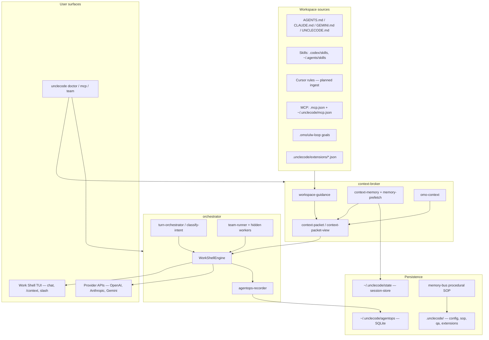
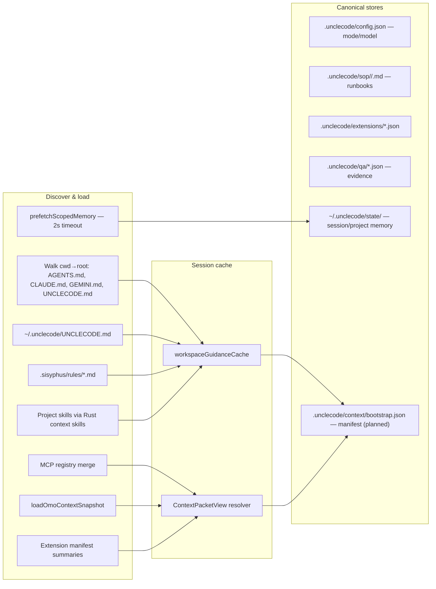
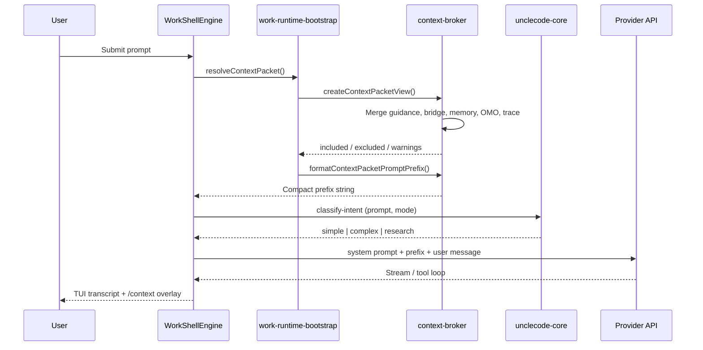
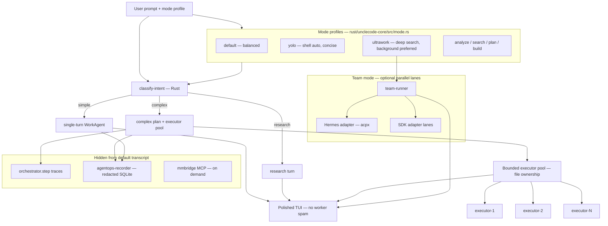
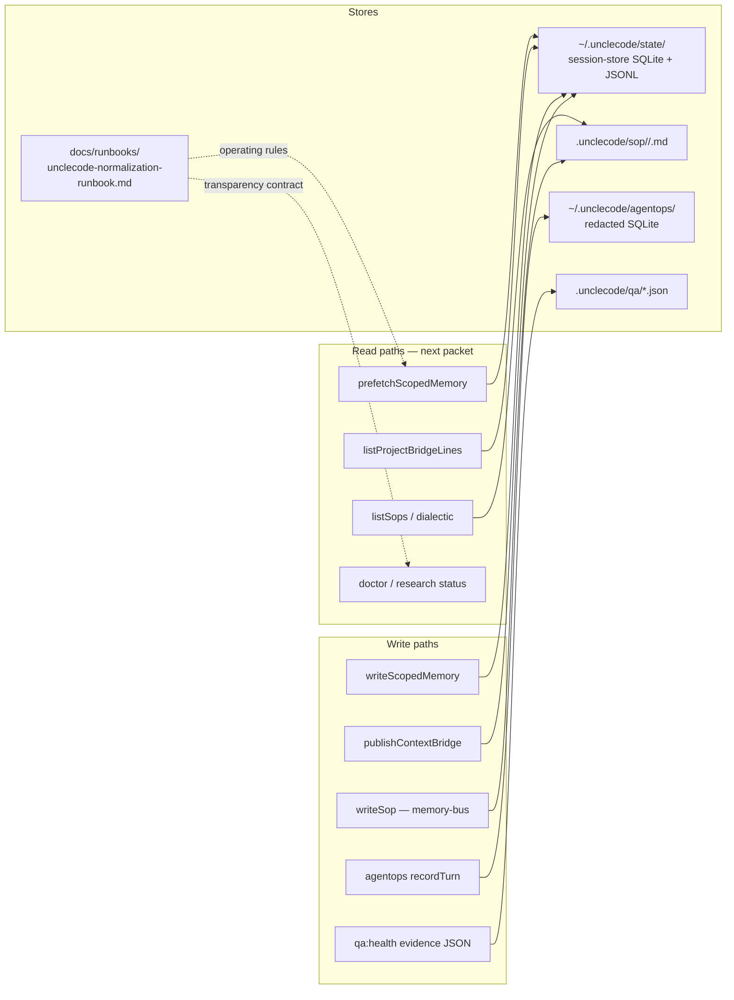

# Persistent Context Architecture

> **Status:** architecture reference (2026-07-05)  
> **Audience:** operators, contributors, planner/executor cycles  
> **Related:** [`context-bootstrap-pipeline.md`](./context-bootstrap-pipeline.md), [`../runbooks/unclecode-normalization-runbook.md`](../runbooks/unclecode-normalization-runbook.md)

UncleCode의 핵심 제품 객체는 **다음 모델 호출 패킷(next model-call packet)** 입니다. 이 문서는 그 패킷이 어디서 오고, 어떻게 분류되며, 어떤 저장소에 남는지를 한 장의 아키텍처로 정리합니다.

---

## Design thesis

1. **Inspectability over black boxes** — 포함·제외·압축·신선도(freshness)마다 이유가 있어야 합니다.
2. **Repo-local persistence** — `.unclecode/`(프로젝트) + `~/.unclecode/`(사용자)가 공유 컨텍스트의 홈입니다.
3. **Hidden orchestration** — 모드·intent·팀 워커는 백엔드에서 처리하고, TUI는 대화와 `/context`에 집중합니다.
4. **Runbook as contract** — 메모리·패킷·QA 규칙은 정규화 런북이 SSOT입니다.

---

## System context



---

## 1. Bootstrap: sources → `.unclecode/` store

세션 시작(`unclecode work`) 시 워크스페이스 컨텍스트 소스를 수집합니다. 오늘은 **live read + in-memory cache**가 주 경로이고, **`.unclecode/context/bootstrap.json` manifest**는 설계·점진 도입 대상입니다 (`context-bootstrap-pipeline.md` T11).



### Bootstrap source map

| Source | Loader | Stored / cached | Model prompt | `/context` view |
| --- | --- | --- | --- | --- |
| Guidance md | `context_guidance.rs` → `workspace-guidance.ts` | In-memory cache | Full appendix (headers) | Summary only; raw withheld |
| Project skills | `context_skills.rs` | Embedded in guidance today | Full SKILL.md bodies | "Loaded skills" line |
| User skills | `listAvailableSkills` | On-demand `/skill` | Not auto-injected | `/skills` panel |
| MCP servers | `loadMcpHostRegistry` | Config files on disk | Not in default prefix | Session Center list; packet wiring partial |
| Scoped memory | `memory-prefetch.ts` | `~/.unclecode/state/` JSONL + SQLite | Summaries + cite ids | scope · cite · fresh\|recent\|aged |
| OMO goals | `omo-context.ts` | `.omo/ulw-loop/` | Active goal summaries | Included; ledger excluded |
| Cursor rules | **Not yet** | — | — | Gap (T11-E3) |

**Code anchors:** `apps/unclecode-cli/src/work-runtime-bootstrap.ts`, `packages/context-broker/src/workspace-guidance.ts`, `rust/unclecode-core/src/context_guidance.rs`

---

## 2. Classify → context-packet → model prefix

수집된 소스는 `createContextPacketView`로 **included / excluded / warnings**에 분류됩니다. 포맷터 단일 정본은 `packages/context-broker/src/context-packet-view.ts`입니다.



### Classification rules (operating contract)

| Category | Default policy | Example |
| --- | --- | --- |
| **Included** | Active OMO goals, memory summaries, bridge lines, safe guidance previews | `project · fix auth gate · cite memory:… · fresh` |
| **Excluded** | Raw OMO ledger/evidence, oversized skill bodies (future), secrets | `ledger.jsonl — held back (raw artifact)` |
| **Warnings** | Multiple OMO sessions, prefetch degrade, malformed JSON | `Memory prefetch timed out — empty lines` |

`assembleContextPacket` (repo map, hotspots, token budget)는 **research 경로**에서 주로 쓰이며, Work Shell 기본 패킷에는 아직 미연결입니다.

**Code anchors:** `packages/context-broker/src/context-packet.ts`, `context-packet-view.ts`, `memory-transparency.ts`

---

## 3. Mode router and hidden workers

모드는 **행동 프로필**을, intent 분류는 **턴 라우팅**을 담당합니다. 사용자는 TUI footer에서 모드를 보고 `/mode set`으로 바꿉니다; 내부 워커는 transcript에 최소 노출만 합니다.



### Mode profile matrix

| Mode | Editing | Search depth | Background tasks | Shell auto (`UNCLECODE_ALLOW_RUN_SHELL`) |
| --- | --- | --- | --- | --- |
| `default` | allowed | balanced | allowed | gated |
| `yolo` | allowed | balanced | preferred | **on** |
| `ultrawork` | allowed | deep | preferred | **on** |
| `search` | forbidden | deep | preferred | gated |
| `plan` | forbidden | deep | forbidden | gated |

**Parallel** in product terms maps to: (a) complex-turn executor pool with `maxWorkers`, (b) `ultrawork` background preference, (c) `team run --lanes` with Hermes/SDK workers — not a separate mode id.

**Code anchors:** `packages/orchestrator/src/turn-orchestrator.ts`, `work-agent.ts`, `team-runner.ts`, `rust/unclecode-core/src/mode.rs`

---

## 4. Persistence: session-store, memory-bus, agentops, runbook



### Persistence responsibilities

| Store | Package | Scope | Failure mode |
| --- | --- | --- | --- |
| **session-store** | `@unclecode/session-store` | Project memory (SQLite), session/user/agent JSONL under `~/.unclecode/state/` | Prefetch timeout → degrade empty (2s) |
| **memory-bus** | `@unclecode/memory-bus` | Procedural SOPs in `.unclecode/sop/`; dialectic synthesis | Not wired to Work Shell bootstrap yet |
| **agentops** | `@unclecode/agentops-db` | Work Shell run + turn events, secrets redacted | **Non-blocking** — recorder failure must not break shell |
| **runbook (docs)** | — | Human+agent SSOT for packet rules, QA gates, escalation | Doc drift if code changes without T10/T11 sync |
| **external Runbook product** | separate repo | Cross-agent AgentOps DB (`~/project/runbook`) | **No sync today** — boundary documented in runbook |

### Memory transparency line format

```
scope · summary · cite memory:<id> · fresh|recent|aged
```

Implemented in `packages/context-broker/src/memory-transparency.ts`, surfaced via `/context` and prefetch in `work-shell-engine-context.ts`.

---

## Package dependency direction

UncleCode stabilization preserves this DAG (Hermes #14182 pattern):

```
contracts
  → config-core, policy-engine, session-store, memory-bus, context-broker
    → orchestrator
      → tui, providers
        → apps/unclecode-cli
rust/unclecode-core ← invoked via rust-command (guidance, mode, intent, token budget)
```

Provider code must not depend on CLI auth/UI layers except through typed runtime config.

---

## Planned evolution (T11 bootstrap manifest)

See [`context-bootstrap-pipeline.md`](./context-bootstrap-pipeline.md) for incremental tasks:

1. **T11-E1** — Write `.unclecode/context/bootstrap.json` manifest (audit trail, no prompt change)
2. **T11-E2** — MCP/extensions in packet; prefetch degrade warnings
3. **T11-E3** — Cursor rules ingest
4. **T11-E4** — Skills catalog vs full-body inject split
5. **T11-E5** — `.cursor/skills` scan path

---

## Verification

```bash
# Operating gate
npm run qa:health

# Context broker unit tests
npm run test:context-broker

# Bootstrap guidance smoke
node -e "import('@unclecode/context-broker').then(m => m.loadCachedWorkspaceGuidance({ cwd: process.cwd() }).then(g => console.log(g.sources)))"

# Evidence artifacts
cat .unclecode/qa/runtime-qa-latest.json
cat .unclecode/qa/live-provider-latest.json
```

---

## References

- PRD: `docs/specs/2026-06-04-context-management-optimized-tui-prd.md`
- Runbook: `docs/runbooks/unclecode-normalization-runbook.md`
- Bootstrap gap analysis: `docs/design/context-bootstrap-pipeline.md`
- Devil's advocate: `docs/design/devils-advocate-review-2026-07.md`
- Roadmaps: `docs/plans/2026-06-01-agent-skill-mcp-minimalism-roadmap.md`, `docs/plans/2026-04-11-unclecode-product-hardening-roadmap.md`
