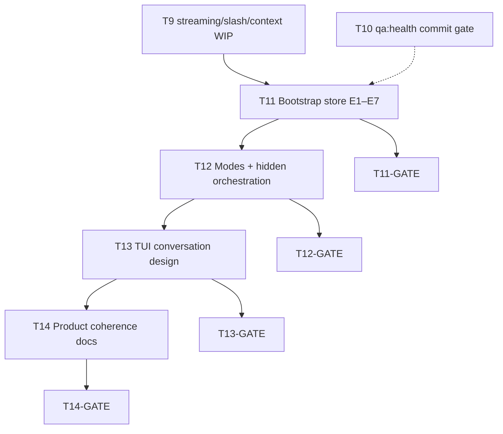

# UncleCode Holistic Roadmap (2026-07)

> **Status:** master plan (Planner, 2026-07-05)  
> **Scope:** modes · context bootstrap · TUI conversation design · product coherence — one architecture, phased execution  
> **Constraint:** no large code in this pass; Executor picks **one T11–T14 step at a time**  
> **Related:** [`context-bootstrap-pipeline.md`](./context-bootstrap-pipeline.md), [`persistent-context-architecture.md`](./persistent-context-architecture.md), [`devils-advocate-review-2026-07.md`](./devils-advocate-review-2026-07.md), `DESIGN.md`, `AGENTS.md`

---

## Executive summary

UncleCode is converging on a **Fable-5-style split**: a strategic planner coordinates hidden workers; the operator sees a **polished Korean-first conversation** and an inspectable **next-call context packet** — not raw JSON, subtask arrays, or orchestrator internals.

Recent landed work (avoid duplicating):

| Commit | What shipped |
| --- | --- |
| `51d5aed` | OpenAI `stream:true` + SSE + stream smoke |
| `2ac2f76` | Slash arg hints, display-width truncation tests |
| `65aaf2c` | `context-packet-view` single canonical formatter in context-broker |
| `8a3ef52` | Composer hint row, busy/queue dock accent |
| `fbe4722` | Conversation rail, status grouping, footer cwd+context chip |

Still open (scratchpad / WIP): T9-B3 memory transparency wiring, T9-B4 runbook, T10 `qa:health` gate, classifier drift for short ultrawork prompts, JSON leak on complex turns, bootstrap store (T11-E1+), Korean product copy unification.

---

## Phase B — Holistic architecture map

One pipeline. Every region has a single owner and a Keep / Fix / Add / Remove contract.

```mermaid
flowchart LR
  subgraph B["① Bootstrap (.unclecode + workspace)"]
    B1[Guidance · skills · MCP · memory · OMO · extensions]
    B2["bootstrap.json manifest (planned)"]
  end

  subgraph C["② Classify (context-packet + intent)"]
    C1[ContextPacketView included/excluded/warnings]
    C2["classify-intent — simple | complex | research"]
  end

  subgraph M["③ Mode router"]
    M1["Profiles: default · yolo · ultrawork · search · analyze · plan · build"]
    M2["Worker budget + shell auto + reasoning defaults"]
  end

  subgraph T["④ Tools"]
    T1[MCP registry · mmbridge on demand]
    T2[Skills on /skill · procedural SOP disk]
    T3[Provider tools — shell, read, write]
  end

  subgraph O["⑤ Orchestrator (HIDDEN)"]
    O1[Planner LLM — yolo/ultrawork only]
    O2[Bounded executor pool + file ownership]
    O3[Guardian + synthesis → ONE reply]
    O4["team-runner lanes (optional, separate RUN_ID)"]
  end

  subgraph P["⑥ TUI presentation"]
    P1[Transcript — user + final assistant only]
    P2[Status · busy · /context overlay]
    P3[Session Center trace — diagnostic depth]
  end

  U[⑦ User — Korean polished answers]

  B --> C --> M --> T
  M --> O
  C --> O
  T --> O
  O --> P --> U
```



### Region contract matrix

| Region | Keep | Fix | Add | Remove |
| --- | --- | --- | --- | --- |
| **① Bootstrap** | Live guidance walk (`context_guidance.rs`); `ContextPacketView` formatter; memory prefetch + transparency helpers (WIP) | Silent `prefetchScopedMemory` degrade; MCP/extensions absent from packet; skills fully embedded in every system prompt | `.unclecode/context/bootstrap.json` manifest (T11-E1); Cursor rules ingest (E3); MCP summary in packet (E2); skills catalog vs inject split (E4) | Illusion that `/context` equals full model context without bootstrap audit trail |
| **② Classify** | Rust `classify-intent` SSOT; routing prompt extraction from `</unclecode_context_packet>` | Short ultrawork info questions misclassified as `complex` (known contract test failure); prefetch degrade not a packet warning | Bootstrap generation stamp + source counts in `/context`; honest excluded reasons for withheld guidance | Duplicate intent logic in TypeScript |
| **③ Mode router** | Seven profiles in `mode.rs`; `resolveWorkerBudget` (yolo=4, ultrawork=5); yolo/ultrawork shell auto | English-only mode labels in Rust `ux_text.rs` (`ultrawork` → "Parallel mode") vs Korean operator expectations; `plan` profile not wired to read-only orchestration UX | Korean mode label table (single owner: Rust → TS re-export); `/mode` copy aligned to behavior matrix below | Treating "Parallel mode" as a separate mode id (it is **ultrawork** behavior + optional team lanes) |
| **④ Tools** | MCP merge (`~/.unclecode/mcp.json` + `.mcp.json`); project skills via Rust; mmbridge slash path | Tools/trace noise in main transcript (DESIGN.md: diagnostic depth belongs in context/trace surfaces) | Bootstrap-classified MCP catalog line; pinned skills file `.unclecode/context/pinned-skills.json` | Auto-loading full SKILL.md bodies at every session start (token bloat) |
| **⑤ Orchestrator** | `turn-orchestrator` honesty (planner trace only when LLM used); bounded pool + ownership; synthesis after executors | **JSON leak:** planner prompt demands raw JSON array; failed parse / executor text can surface in transcript; phantom `planner-running` when parse fails | **Presentation filter:** complex turn exposes **one synthesized Korean assistant message**; intermediate executor JSON hidden; status line "N workers · synthesizing…" | Raw subtask JSON, planner arrays, or per-executor dumps in Work Shell transcript |
| **⑥ TUI** | Conversation rail; grouped status `model · mode │ auth │ activity`; compact `/context` overlay; streaming cursor (`51d5aed`+) | TS↔Rust copy drift (`work-shell-footer-fast-paths.ts` vs `ux_text.rs`); partial stream display edge cases (T6-P3) | Korean busy copy; optional "thinking expanded" affordance without leaking worker output; mode tooltip via `/mode status` | Duplicate spinners; redundant badges; orchestrator steps in default chat stream |
| **⑦ User** | Single-turn answers for simple/research | Complex turns that read like internal runbooks | One coherent **우리** voice: docs + slash descriptions + status/footer in Korean where product-facing | Mixed EN/KO mode names and unexplained "Parallel" |

**Code anchors:** `apps/unclecode-cli/src/work-runtime-bootstrap.ts`, `packages/context-broker/*`, `packages/orchestrator/{turn-orchestrator,work-agent,work-shell-engine-*}.ts`, `packages/tui/work-shell-view.tsx`, `rust/unclecode-core/src/{orchestrator,mode,ux_text,context_guidance}.rs`

**Integrated audit:** [`context-bootstrap-pipeline.md`](./context-bootstrap-pipeline.md) — gap table, T11-E1…E7; do not re-audit before E1.

---

## Phase C — Ultrawork & modes spec (UncleCode-specific)

### Product naming (우리 system — modes)

Internal id stays stable for config/tests. User-facing Korean copy is the product surface.

| Internal id | Current EN label | Proposed KO label (status/footer) | Behavior summary |
| --- | --- | --- | --- |
| `default` | Work mode | **작업 모드** | Balanced editing + search; shell gated |
| `yolo` | YOLO mode | **YOLO 모드** | Full autonomy; shell auto; complex when action keywords |
| `ultrawork` | Parallel mode | **집중 작업 모드** (or **병렬 작업**) | Deep search + background workers; lower complex bar — **not** a separate "team mode" |
| `search` | Search mode | **탐색 모드** | Read-only; research routing |
| `analyze` | Analyze mode | **분석 모드** | Read-only; research routing |
| `plan` | plan mode | **계획 모드** | No edits; planning-only turns (align with profile: editing forbidden) |
| `build` | build mode | **구현 모드** | Implementation-focused; static complex decomposition allowed |

**Parallel vs team vs ultrawork (clarity rule):**

1. **Simple question** (greeting, "패러랠 모드가 뭐냐", `/help`) → **single-turn** answer in any mode; never spawn planner JSON.
2. **Complex work** in `yolo` / `ultrawork` → hidden planner (optional LLM) → executor pool → guardian (optional) → **one synthesized Korean reply**.
3. **Team parallel** → explicit `team run --lanes N` + `team-binding` RUN_ID; Session Center / agentops visibility; **not** the default ultrawork path.

### Fable-5 orchestration pattern

```
User prompt (KO)
    → classify-intent
        simple  → direct model → stream to TUI (no subtasks)
        research → research turn → stream
        complex → [HIDDEN] planner → executors → synthesis → ONE assistant bubble
    → TUI shows: busy "⠋ 집중 작업 · 3 workers" (no JSON)
    → /context unchanged unless reload
```

**JSON leak prevention (spec, not yet fully implemented):**

| Leak source | Fix |
| --- | --- |
| Planner prompt "Return ONLY a JSON array…" | Keep internal; **never** append planner raw output to transcript |
| `parseAgentPlanResponse` failure | Fall back to static tasks silently; clear planner-running UI state |
| Executor `runInternalTurn` returns markdown+JSON | Synthesis step strips structure; transcript gets synthesis output only |
| Guardian review text | Fold into synthesis; do not emit separate chat entry |
| `orchestrator.step` traces | Session Center / agentops only; filter from Work Shell `chatEntries` |

**Classifier fixes (T12):**

- Greetings and mode-explanation questions stay `simple` in `ultrawork` (partially in Rust tests; extend Korean patterns).
- Context-packet prefix must not trigger complex routing (already: `extract_routing_prompt`).
- Contract test `classifyWorkIntent routes ultrawork prompts to complex` — **rename or split**: short informational ultrawork prompts → `simple`; action prompts → `complex`.

### Mode × intent matrix (operator contract)

|  | simple | research | complex |
| --- | --- | --- | --- |
| **default** | 1 turn | research agent | static tasks, 1 worker |
| **yolo** | 1 turn | research | LLM planner + up to 4 workers + synthesis |
| **ultrawork** | 1 turn (incl. "what is X") | research | LLM planner + up to 5 workers + synthesis |
| **plan** | 1 turn (read-only copy) | research | plan output only — **no executor pool** (future T12 wiring) |
| **search / analyze** | 1 turn | default path | N/A (research preferred) |

---

## Phase D — Roadmap T11–T14 (Executor phases)

Each phase ends with **`npm run qa:health` (14/14)** except where noted. One Executor step per PR; file boundaries enforced.

### T11 — Context bootstrap store (extends existing T11-E1…E7)

**Owner theme:** context-broker + work-runtime-bootstrap  
**Do not duplicate:** [`context-bootstrap-pipeline.md`](./context-bootstrap-pipeline.md)

| Step | Owner boundary | Success criteria | qa:health |
| --- | --- | --- | --- |
| **T11-E1** | `packages/context-broker/src/bootstrap-manifest.ts` (new), `work-runtime-bootstrap.ts` | `.unclecode/context/bootstrap.json` written on `unclecode work`; unit test fixtures; **no prompt behavior change** | broker tests only |
| **T11-E2** | `work-runtime-bootstrap.ts`, `work-shell-engine-context.ts`, `memory-prefetch.test.mjs` | MCP + extensions in packet; prefetch `degraded` → warning line | context-broker + orchestrator tests |
| **T11-E3** | `packages/context-broker/src/cursor-rules.ts` (new) | `.cursor/rules` in manifest + summary lines | new + existing broker tests |
| **T11-E4** | `workspace-guidance.ts`, `context_guidance.rs` | Default: skill names only; `/skill` loads body | guidance + skills tests |
| **T11-E5** | `context_skills.rs` | Scan `~/.cursor/skills`, `<cwd>/.cursor/skills` | Rust + broker tests |
| **T11-E6** | `work-runtime-bootstrap.ts` | `/context` reload regenerates manifest | reload test |
| **T11-E7** | `docs/runbooks/unclecode-normalization-runbook.md` | Bootstrap section + scratchpad | doc-only, no qa:health |
| **T11-GATE** | Coordinator | E1–E6 merged; runbook updated | **qa:health 14/14** |

### T12 — Modes, classifier & hidden orchestration

**Owner theme:** orchestrator + rust orchestrator + presentation filter

| Step | Owner boundary | Success criteria | qa:health |
| --- | --- | --- | --- |
| **T12-E1** | `rust/unclecode-core/src/orchestrator.rs`, `tests/contracts/orchestrator-multi-agent.contract.test.mjs` | KO/EN info questions → `simple` in ultrawork; action prompts → `complex` | contract + rust test |
| **T12-E2** | `rust/unclecode-core/src/ux_text.rs`, `packages/tui/src/work-shell-footer-fast-paths.ts` | Single mode label source; Korean KO labels per table above | test:tui + rust ux tests |
| **T12-E3** | `packages/orchestrator/src/work-agent.ts`, `work-shell-engine-post-turns.ts` | Complex turn: chat transcript = synthesis text only; traces to panel/agentops | work-shell-engine tests |
| **T12-E4** | `rust/unclecode-core/src/mode.rs`, slash builtins | `plan` mode blocks edit tools / surfaces read-only hint | repl + orchestrator tests |
| **T12-E5** | `docs/design/persistent-context-architecture.md`, slash descriptions | Mode matrix + KO copy synced | doc-only |
| **T12-GATE** | Coordinator | Ultrawork question "병렬 모드가 뭐야" → single Korean paragraph, no JSON | **qa:health 14/14** |

### T13 — TUI & terminal conversation design

**Owner theme:** packages/tui + DESIGN.md

| Step | Owner boundary | Success criteria | qa:health |
| --- | --- | --- | --- |
| **T13-E1** | `DESIGN.md`, `docs/specs/2026-06-03-work-shell-ux-quality-standard.md` | Region map: what each TUI band shows / hides (this doc §T13 matrix) | doc-only |
| **T13-E2** | `work-shell-view.tsx`, `ux_text.rs` | Busy copy KO; streaming partial text verified (T6-P3) | stream smoke + test:tui |
| **T13-E3** | `work-shell-panels.ts`, `dashboard-components.tsx` | Orchestrator traces only in Session Center trace strip, not chat rail | contract tui-work-shell |
| **T13-E4** | `work-shell-slash.ts`, Rust slash metadata | `/mode`, `/context`, `/harness` KO descriptions | repl slash tests |
| **T13-E5** | `scripts/runtime-qa/tui-korean-smoke.mjs` | Hangul mode labels + footer no truncation regressions | runtime QA subset |
| **T13-GATE** | Coordinator | Visual QA captures in `.unclecode/qa/` | **qa:health 14/14** |

#### T13 region show / hide matrix

| TUI region | Show | Hide |
| --- | --- | --- |
| **Header** | Provider title, shortcut hint | Mode reasoning internals |
| **Status line** | `model · mode │ auth │ activity`, single spinner | Duplicate busy indicators, worker ids |
| **Conversation rail** | User, final assistant, system feedback (muted) | Planner JSON, executor raw output, tool JSON |
| **Composer** | Input, slash hints, queue paused | Full context packet |
| **Footer** | cwd, one context chip | Model/auth (moved to status) |
| **`/context` overlay** | Sources fact line, grouped summaries, warnings | Raw guidance bodies, ledger paths |
| **Session Center** | Trace entries (≤4), workers, approvals | N/A — diagnostic home |
| **Dashboard panels** | Research/history/MCP lists | Fake orchestrator roles |

### T14 — Product coherence & docs (우리)

**Owner theme:** docs + README + runbook + AGENTS.md boundary

| Step | Owner boundary | Success criteria | qa:health |
| --- | --- | --- | --- |
| **T14-E1** | `README.md` Architecture section | Links this roadmap + bootstrap pipeline; KO one-paragraph product thesis | doc-only |
| **T14-E2** | `docs/runbooks/unclecode-normalization-runbook.md` | Modes KO glossary; bootstrap verify commands; T11–T13 gates | doc-only |
| **T14-E3** | `DESIGN.md` Components | Korean copy rules for badges, busy, empty state | doc-only |
| **T14-E4** | `docs/design/devils-advocate-review-2026-07.md` | Close or defer F1–F5 with T11–T13 status | doc-only |
| **T14-E5** | Demos / `demos/unclecode-hyperframes-demo` | Mode names match KO glossary (optional) | manual |
| **T14-GATE** | Coordinator + Planner | Scratchpad T11–T14 complete; no conflicting EN "Parallel mode" in operator paths | **qa:health 14/14** |

---

## Dependency graph



**Parallelism rule:** Do not run T12-E3 (transcript filter) before T11-E2 (packet warnings) if both touch `work-runtime-bootstrap.ts` — sequence E2 then E3 or split files.

---

## Verification gates (all phases)

| Gate | Command | Pass |
| --- | --- | --- |
| Narrow | Phase-specific tests in step table | All green |
| Integration | `npm run qa:health` | 14/14 exit 0 |
| Manual | `unclecode work` → ultrawork → "병렬 모드 설명해줘" | Single KO reply, no JSON |
| Manual | `/context` after bootstrap | Sources + warnings visible |
| Evidence | `.unclecode/qa/runtime-qa-latest.json` | hangulResidual=false, stream ok |

---

## References

- Commits: `fbe4722`, `8a3ef52`, `65aaf2c`, `2ac2f76`, `51d5aed`, `3fe23ea`
- Specs: `docs/specs/2026-04-05-unclecode-tui-orchestration-redesign.md`, `docs/specs/2026-06-04-context-management-optimized-tui-prd.md`
- Scratchpad: `.cursor/scratchpad.md` (T11–T14 board)
