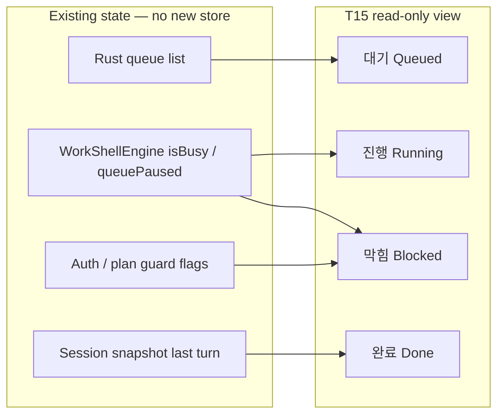

# T15 — Work Queue Board (Mini Kanban)

Status: **Shipped** (2026-07-05). T15-E0–GATE complete; review follow-ups P0–P2 landed 2026-07-05.

Related: [DESIGN.md](../../DESIGN.md) §4–6, [work-shell UX standard](../specs/2026-06-03-work-shell-ux-quality-standard.md) §Interrupt/Queue.

## Goal

Give operators a **read-only work board** in the TUI without building Jira/Linear. Map **existing** orchestrator + Rust queue state to four columns. No new database, no drag-and-drop in v1.

## UX decision: extend `/queue`, not `/board`

| Option | Verdict |
| --- | --- |
| New `/board` slash | ❌ Splits recovery path; another command to discover |
| Footer chip only | ❌ Too little detail for backlog + blocked reasons |
| **`/queue` panel → board layout** | ✅ Canonical interrupt recovery already documented; reuse Rust `queue-command` + panel title |

Panel title: **`Work board`** (subtitle line keeps `Queue` semantics for search/help). Slash command stays **`/queue`**.

## Information architecture



| Column | KO label | EN hint (muted) | Source |
| --- | --- | --- | --- |
| Queued | **대기** | queued | `queuedItems`, `queuedCount`; show `#id · preview` |
| Running | **진행** | running | Active turn: `busyStatus` + truncated current prompt; ultrawork adds worker budget line |
| Blocked | **막힘** | blocked | `queuePaused`, `requires_action` auth, plan/read-only guard — **one primary reason** |
| Done | **완료** | done | Last completed turn: `user preview → assistant preview` (one row, 64-char display-width) |

Empty column: em dash `—` on one line (not “No items” essay).

## Layout (terminal-native)

### ≥100 columns — single row, four columns

```
┌─ Work board ───────────────────────────────────────────────────────────────┐
│ State · running · ultrawork · workers 3                                    │
├──────────────┬──────────────┬──────────────┬──────────────────────────────┤
│ 대기 · 2     │ 진행 · 1     │ 막힘 · 1     │ 완료 · 1                     │
│ #1 second…   │ ⠋ thinking   │ pause · 2    │ hi → 반갑습니다…             │
│ #2 third…    │   first…     │   queued     │                              │
├──────────────┴──────────────┴──────────────┴──────────────────────────────┤
│ Enter queues · Esc interrupt · /queue clear drops · next msg resumes       │
└────────────────────────────────────────────────────────────────────────────┘
```

- Column headers: `KO · count` (count optional when 0).
- Cell previews: `truncateForDisplayWidth` (broker helper), **never** raw `.slice`.
- Box drawing: same weight as Context overlay (`RoundedPanel` / dashboard primitives).
- Max **3 rows per column**; overflow `+N more` using display-width safe suffix.

### 80 columns — 2×2 stack

```
┌─ Work board ─────────────────────────────┐
│ 대기 · 2          │ 진행 · 1           │
│ #1 … #2 …         │ ⠋ thinking …       │
├───────────────────┼────────────────────┤
│ 막힘 · 1          │ 완료 · 1           │
│ pause · 2 queued  │ hi → …             │
└───────────────────┴────────────────────┘
```

Drop EN hints in header before truncating KO labels (DESIGN: drop optional hints first).

### Composer dock (unchanged + aligned)

- Indicator: existing `⋯ N queued · paused · /queue clear` (`formatWorkShellQueueIndicator`).
- Hint row when paused: **warning accent** (`--status-warning`), copy from DESIGN §4 composer variants.
- **Do not** add a second spinner or duplicate busy row under conversation.

## Visual tokens (DESIGN.md)

| Element | Token / pattern |
| --- | --- |
| Column headers | `--text-secondary`, bold count only |
| Running cell | sky accent on spinner + activity (status strip parity) |
| Blocked cell | `--status-warning` label + muted detail |
| Done cell | `--text-muted`, no checkmark emoji requirement — optional `✓` only if display-width ≥2 cols |
| Dividers | muted `│` / box lines, one row between header and grid |
| Panel motion | **none** (instant open on `/queue`) |
| Busy motion | 100ms spinner in **진행** column only — not duplicated in header if board open |

## States checklist

| State | Board behavior |
| --- | --- |
| Idle, empty queue | All columns `—` except **완료** if last turn exists |
| Busy, queue empty | **진행** filled; **대기** `—` |
| Busy + queued | **대기** lists items; **진행** active turn |
| Interrupt + pause | **막힘** shows `interrupt · N queued · paused`; **대기** still lists items |
| After next chat turn | Pause clears (T15 depends on shipped queue resume); **막힘** empty |
| Auth requires_action | **막힘** primary: auth label + one recovery hint |
| Plan mode edit attempt | **막힘**: read-only guard message (KO) |

## Accessibility & keyboard (v1)

- Read-only: **no** column focus ring in v1; `/queue` toggles panel, Esc closes overlay (existing).
- State readable without color: every column has text label + count.
- Korean/CJK previews tested at 80/100/120 cols in runtime QA extension (T15-GATE).

## Anti-patterns (do not ship)

- Drag-and-drop reorder (v2+ only, needs Rust queue reorder API).
- Heavy “cards” with double borders for single-line previews.
- Fake kanban IDs or persisted column membership.
- Duplicate activity row below conversation when board is open.
- English-only column titles in KO-first product copy.
- Truncating Korean mid-glyph (raw `.length`).

## Implementation boundaries (for Executor)

| Step | Owner | Files (indicative) |
| --- | --- | --- |
| T15-E0 | Planner | this doc + scratchpad (done) |
| T15-E1 | Rust UX | `ux_panels.rs` — `queue_panel` → board lines + width mode flag |
| T15-E2 | Orchestrator | pass `lastCompletedTurn`, `blockedReason`, `terminalColumns` into queue builtin |
| T15-E3 | TUI | render board grid in overlay; wire `terminalColumns` |
| T15-E4 | QA | extend `tui-suite-smokes` or contract: 100-col capture, queue paused column |
| T15-GATE | Coordinator | `npm run qa:health` 14/14 |

## Verification (T15-GATE)

- [x] `/queue` at 100 cols: four columns, no overflow in `calculatePaneWidth`
- [x] Interrupt → **막힘** shows paused; after next chat → drain visible in **대기** emptying
- [x] Korean preview lines: no hangul residual / mid-char truncation in smoke (P0 display-width fix)
- [x] Composer indicator unchanged when panel closed; warning tint when paused
- [x] Work board rebuilds 2×2 ↔ 4-col on `terminalColumns` resize without re-running `/queue`
- [x] **막힘** blockedReason: OAuth api-blocked, auth issue context, not signed in, plan/read-only guard
- [x] **완료** uses session snapshot `lastCompletedTurn` (idle persist), not transient live entries
