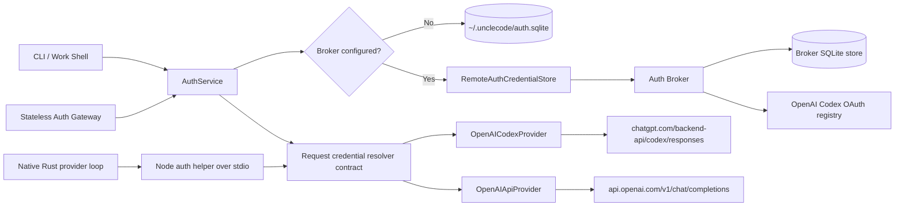

# UncleCode OpenAI Codex OAuth and Auth-Broker Design

**Date:** 2026-08-09
**Status:** Revised after independent review; implementation-ready pending a clean final review
**Source basis:** OMP 17.2.12 (`@oh-my-pi/pi-ai` and `@oh-my-pi/pi-coding-agent`), MIT licensed
**Product decision:** `openai-codex` is OAuth-first; `openai-api` is an explicit API-key provider

## 1. Goal

Replace UncleCode's current single-credential OpenAI readiness check with a provider-scoped authentication subsystem that preserves OMP's core authentication behavior:

- browser and device-code OAuth login;
- a durable multi-account SQLite credential store;
- refresh single-flight and cross-process refresh fencing;
- credential rotation, cooldowns, and durable rate-limit blocks;
- definitive-failure tombstones instead of destructive deletion;
- local-store or remote-broker discovery from one API;
- broker-side refresh so refresh tokens are never returned to normal request clients (a login client may transmit one once to a configured broker);
- an optional authenticated gateway for clients that cannot hold provider credentials;
- clean separation between ChatGPT Codex OAuth and OpenAI Platform API keys.

UncleCode deliberately hardens OMP's broker cache: its encrypted disk snapshot is metadata-only and cannot authorize requests before live broker revalidation. This trades OMP's cached-token offline availability for fail-closed revocation and authority semantics.

This is a functional port, not a new dependency on OMP and not a wholesale replacement of UncleCode's provider runtime. UncleCode owns the resulting modules, naming, storage path, CLI, and tests. Code substantially adapted from OMP keeps MIT attribution and is recorded as `licensed-reuse` in the provenance manifest.

## 2. User-visible contract

### 2.1 Provider identities

The ambiguous `openai` provider ID is removed from runtime configuration and replaced everywhere by two explicit providers:

| Provider ID | Credential | Endpoint | Default role |
| --- | --- | --- | --- |
| `openai-codex` | ChatGPT/Codex OAuth | `https://chatgpt.com/backend-api/codex/responses` | Default OpenAI experience |
| `openai-api` | OpenAI Platform API key | Existing `https://api.openai.com/v1/chat/completions` transport | Explicit opt-in |

`openai-codex` never silently consumes `OPENAI_API_KEY`. `openai-api` never consumes a Codex OAuth token. A missing credential produces a provider-specific remediation message.

Provider and model configuration becomes unambiguous:

- `LLM_PROVIDER=openai-codex|openai-api|anthropic|gemini|...`
- `OPENAI_CODEX_MODEL` for `openai-codex`
- `OPENAI_API_MODEL` for `openai-api`
- `OPENAI_API_KEY` only for `openai-api`
- `OPENAI_CODEX_OAUTH_TOKEN` only as an explicit non-persistent runtime override for `openai-codex`

There is no compatibility alias from `openai` to either new provider. Config examples, tests, provider registry entries, model commands, readiness output, native runtime selection, and Pi bridge selection migrate in the same cutover.

#### 2.1.1 Removed and renamed configuration

The cutover rejects ambiguous legacy configuration with one actionable error: `Provider "openai" was split. Use "openai-codex" for ChatGPT OAuth or "openai-api" for OPENAI_API_KEY.`

| Removed input | Replacement |
| --- | --- |
| `LLM_PROVIDER=openai` | `LLM_PROVIDER=openai-codex` or `LLM_PROVIDER=openai-api` |
| `ANTHROPIC_COMPAT_PROVIDER=openai` | `ANTHROPIC_COMPAT_PROVIDER=openai-api` |
| `OPENAI_MODEL` / `OPENAI_MODELS` | `OPENAI_CODEX_MODEL(S)` or `OPENAI_API_MODEL(S)` |
| `OPENAI_AUTH_TOKEN` | `OPENAI_CODEX_OAUTH_TOKEN` |
| `OPENAI_OAUTH_CLIENT_ID` | Removed; Codex OAuth uses the registered public client ID ported from OMP |

Doctor and config parsing report the removed key and its replacement. They never guess which new provider the user intended.

### 2.2 Authentication commands

The CLI exposes provider-scoped commands:

```text
unclecode auth login openai-codex [--flow browser|device] [--replace-credential <id>]
unclecode auth login openai-api --api-key-stdin
unclecode auth status [openai-codex|openai-api]
unclecode auth accounts openai-codex
unclecode auth logout openai-codex [--credential <id>|--all]
unclecode auth broker serve [--host <host>] [--port <port>] [--allow-non-loopback --tls-cert <path> --tls-key <path>]
unclecode auth gateway serve [--host <host>] [--port <port>] [--allow-non-loopback --tls-cert <path> --tls-key <path>]
unclecode auth migrate legacy-openai
```

Browser OAuth is the default interactive Codex flow. Device-code OAuth is available for SSH/headless terminals. API keys are read from stdin or an interactive hidden prompt, never from a positional argument. `status` and `accounts` display source, account identity, expiry, disabled state, and selection status without displaying token bytes.

Work Shell `/login` and `/logout` use the same auth service. `/login` first selects a provider, then a provider flow. OAuth owns browser/device prompts; the picker does not implement OAuth details.

### 2.3 Readiness semantics

`openai-codex` is ready when the auth service can select a non-disabled OAuth credential whose access JWT decodes to a non-empty `chatgpt_account_id` under the `https://api.openai.com/auth` claim and that has either an unexpired access token or a refresh token. Codex does not require or inspect a `model.request` scope. The normalized `chatgpt_plan_type` captured from the access token's auth claim or, when absent there, the ID token's auth claim is optional display/fallback ranking metadata, not an authentication gate.

`openai-api` is ready only when an explicit API key exists for that provider. A set `OPENAI_API_KEY` shadows a healthy stored `openai-api` row for the process; its failure never falls through to the stored row.

`AuthReadiness` is an offline, non-secret view: provider ID, `ready | refreshable | blocked | missing | error`, usable credential count, source label, and redacted reason. `ready` means at least one currently usable bearer; `refreshable` means an enabled, eligible OAuth row can refresh but no current access bearer is usable; `blocked` means matching enabled rows exist but every candidate is under a temporary block; `missing` means no selectable credential exists; `error` means discovery or the active store cannot be opened safely, including a URL-without-token broker configuration, unreadable/corrupt/newer-schema SQLite database, or an initialized remote store with no live validated snapshot. A disabled-only pool is `missing` with re-login remediation. `auth status`, `doctor`, live-provider QA, and Work Shell labels consume this one view. Readiness performs no network I/O; it reports already-observed store state and never infers usability from file existence alone.

## 3. Package boundaries

### 3.1 `packages/providers/src/auth/` — credential domain and local infrastructure

This folder owns provider-independent authentication contracts and local persistence:

- `types.ts`: `AuthCredential`, `OAuthCredential`, `ApiKeyCredential`, `StoredAuthCredential`, account identity, readiness, disabled summaries, block and lease records.
- `credential-store.ts`: synchronous local-store contract plus optional async hooks used by remote stores.
- `sqlite-store.ts`: the default SQLite implementation.
- `migrations.ts`: schema versioning and all auth tables/indexes.
- `storage.ts`: credential selection, reload, refresh, rotation, blocks, and events.
- `retry.ts`: transient SQLite busy retries only; no retries for corruption or schema errors.
- `oauth-registry.ts`: provider-scoped login/refresh hooks and prompt ownership.
- `oauth-callback-server.ts`: loopback callback listener with state validation and abort support.
- `oauth-device-code.ts`: generic RFC 8628 bounded polling for future providers; the Codex adapter uses its own proprietary device protocol.
- `discovery.ts`: broker/config/env discovery and local SQLite fallback.
- `snapshot-cache.ts`: AES-GCM encrypted metadata-only broker snapshot cache.
- `index.ts`: intentional public exports.

The provider package can use Node built-ins, including `node:sqlite`, but adds no third-party dependency. This is a runtime translation from OMP's `bun:sqlite`: set `busy_timeout` before the first lock-taking pragma, then enable WAL and `synchronous=NORMAL`; tests re-prove contention behavior rather than assuming Bun transaction semantics.

`AuthService` composes two layers. Explicit non-persistent overrides (`OPENAI_CODEX_OAUTH_TOKEN`, `OPENAI_API_KEY`, or an injected test/runtime credential) shadow the active local/remote store; they never get persisted and never silently fall through to the stored pool after failure. Stored rows are the second layer. Runtime credentials use a stable process-local reference such as `runtime:openai-api`; their failures create process-local retry state because no durable credential row exists. This explicit override is the only documented exception to broker authority.

### 3.2 `packages/providers/src/openai/` — explicit OpenAI adapters

OpenAI-specific behavior is split by provider identity:

- `codex-oauth.ts`: browser/device OAuth endpoints, PKCE, token exchange, JWT account/workspace/plan inspection, and refresh.
- `codex-provider.ts`: Codex Responses transport using OAuth access tokens and account headers.
- `api-provider.ts`: the existing OpenAI Platform Chat Completions transport using API keys, moved without changing its wire behavior.
- `codex-responses-wire.ts`: Codex Responses request construction and stream parsing shared only by Codex transports.
- `readiness.ts`: maps auth-service results to provider status.

The old `OpenAIProvider` runtime flag (`"api" | "codex"`) is removed. `OpenAICodexProvider` and `OpenAIApiProvider` each accept an async credential resolver. They resolve immediately before every outbound request so refresh and account rotation are visible without reconstructing the Work Shell.

### 3.3 `packages/providers/src/auth-broker/` — credential authority service

The broker owns the canonical store when configured:

- `types.ts`: wire schemas, snapshot shape, health shape, error shape.
- `client.ts`: authenticated HTTP client with cancellation and bounded retries.
- `server.ts`: bearer-authenticated `/v1/*` API.
- `remote-store.ts`: local snapshot implementing the credential-store contract.
- `refresher.ts`: scheduled pre-expiry refresh and usage reconciliation.
- `discover.ts`: URL/token/config resolution.

The broker is provider-aware through the OAuth registry but transport-agnostic. It never runs model requests.

### 3.4 `packages/providers/src/auth-gateway/` — optional credential-free model proxy

The gateway owns a stateless transport port rather than reusing `LlmProvider.runTurn()` or the Pi tool loop:

```ts
interface GatewayTransport {
  stream(request: CanonicalGatewayRequest, signal: AbortSignal): AsyncIterable<CanonicalGatewayEvent>;
}
```

The canonical event union preserves response start/end, text deltas, reasoning deltas when the upstream transport emits them, tool-call deltas, usage, provider error envelopes, and cancellation. The OpenAI Responses boundary accepts only the subset used by UncleCode clients and rejects unsupported fields with a structured 400. Concrete stateless adapters dispatch to Codex Responses or the existing OpenAI API Chat Completions stream and map both into the canonical event union. The gateway never owns conversation history and never executes tools.

#### 3.4.1 Chat Completions mapping

The API-key adapter translates the accepted Responses subset deterministically:

| Responses request field | Chat Completions field |
| --- | --- |
| `model` | `model` |
| `instructions` | leading `developer` message |
| text/image message input | `messages` using the existing OpenAI API content mapping |
| function tools and `tool_choice` | `tools` and `tool_choice` |
| `max_output_tokens` | `max_tokens` |
| streaming request | `stream: true` with `stream_options.include_usage: true` |

The first upstream chunk emits one canonical response-start event, retaining the upstream response ID or synthesizing a request-scoped ID when absent. `choices[].delta.content` becomes text deltas. `choices[].delta.tool_calls[]` is correlated by choice/tool index and upstream call ID; name and argument fragments remain ordered until the matching tool-call end. A terminal usage object emits one usage event. `finish_reason` maps as `stop -> completed`, `tool_calls -> requires_action`, `length -> incomplete`, and `content_filter -> failed`; unknown values remain a redacted provider terminal reason. HTTP error status and bounded provider error envelopes pass through the canonical provider-error event. Reasoning events are emitted only for upstream fields the existing API transport actually recognizes; the adapter never invents reasoning. Client abort cancels the upstream fetch and emits no synthetic completion.

The gateway is not used by the normal local Work Shell path. It exists for sandboxed or remote clients that must not receive provider credentials.
### 3.5 `apps/unclecode-cli` — UX and process lifecycle

CLI code owns command parsing, hidden input, browser opening, device-code display, cancellation, broker/gateway startup, and human-readable output. It calls exported auth APIs; it does not read SQLite or JSON credentials directly.

### 3.6 Rust boundary

Rust is the outer CLI process. Pi execution already launches Node through `UNCLECODE_NODE`; native execution has no in-process TypeScript parent. TypeScript remains the single credential authority through one persistent, lazily started Node child per native Rust process, `scripts/unclecode-auth-helper.mjs`. The child speaks newline-delimited versioned JSON over private stdin/stdout pipes; secret values never travel in argv or environment. A five-second `HELPER_LIVENESS_MS` bounds spawn through the authenticated `ready` protocol frame only. Each auth operation has a separate `RESOLVE_DEADLINE_MS = 40s`; timeout is a transient provider failure, not a configuration error. This budget exceeds the 15-second crashed-owner lease wait plus one 10-second refresh operation and broker/IPC overhead.

The helper protocol is versioned. `ResolvedRequestCredential` includes `{ credentialRef, credentialVersion, bearerToken, bearerFingerprint, accountId?, organizationId?, projectId?, source }`, where the fingerprint is a SHA-256 digest used only for attempt identity, stored refs are `db:<id>`, and explicit runtime refs are `runtime:<providerId>`.

- resolve request: `{ version: 1, op: "resolve", providerId, model, requestId, sessionId?, excludedCredentialRefs }`;
- resolve response: `{ version: 1, requestId, credential: ResolvedRequestCredential }`;
- failure request: `{ version: 1, op: "report-failure", providerId, credentialRef, credentialVersion, bearerFingerprint, model, status?, errorClass?, retryAfterMs?, resetAtMs?, responseHeaders?, responseBody?, requestId }`; headers are allowlisted rate-limit/request metadata and the body is capped at 8 KiB before crossing the pipe;
- failure response is one of `{ action: "retry-refreshed", credential }`, `{ action: "rotate", blockedUntilMs? }`, `{ action: "retry-same", retryAfterMs }`, or `{ action: "fatal", remediation }`.

The native HTTP loop resolves before each outbound logical request and carries an attempt ledger. `retry-refreshed` may retry the same credential reference once only when the returned bearer fingerprint differs from the failed materialization. An unchanged fingerprint is treated as `rotate`. `rotate` excludes the whole credential reference for the remainder of the logical request. `retry-same` is reserved for transient transport/provider failures and may re-attempt one materialization at most twice after the requested delay. `fatal` stops immediately. The total budget is four outbound HTTP attempts per logical request.

On a failure received before any response-start or user-visible stream event, Rust reports the completed attempt and follows the returned action while preserving the logical turn and tool history. Once a stream event has escaped, Rust does not call `report-failure` for replay; automatic replay is forbidden because it could duplicate output or tool calls, and the stream error is surfaced. Outside the explicitly bounded `retry-same` action, a `(credentialRef, bearerFingerprint)` materialization is never sent twice.

A credential-specific auth failure mutates, refreshes, or blocks a stored row only when `credentialVersion` still matches; a stale failure cannot disable a credential refreshed by another process. TypeScript, not Rust, maps models and bounded provider error facts to Codex meter/block semantics. A failure on a `runtime:*` reference returns `fatal`, creates no durable block, never consults the stored pool, and names the override source in remediation. Helper unavailability fails with provider-specific remediation and never falls back to legacy JSON files. Pi execution calls the same `AuthService` contract in process.
## 4. Credential model and persistence

### 4.1 Credential shapes

Secret bytes are never stored in ordinary enumerable string fields. The domain uses an opaque `SecretValue` with a private field and no implicit string/value coercion:

```ts
type AuthCredential =
  | {
      type: "api_key";
      key: SecretValue;
      organizationId?: string;
      projectId?: string;
    }
  | {
      type: "oauth";
      access: SecretValue;
      refresh: SecretValue;
      expiresAtMs: number;
      email?: string;
      subject?: string;
      accountId?: string;
      organizationId?: string;
      organizationName?: string;
      planType?: string;
    };

type StoredAuthCredential = {
  id: number;
  provider: string;
  credential: AuthCredential;
  credentialVersion: number;
  identityKey?: string;
  disabledCause?: string;
  createdAtMs: number;
  updatedAtMs: number;
  lastUsedAtMs?: number;
};
```

`SecretValue` reveals bytes only to an unexported store/request-wire capability. Its `toJSON` and `nodejs.util.inspect.custom` paths return `[REDACTED]`; `toString`/`valueOf` throw. Credential persistence uses one explicit store-private extractor, and provider/helper wire encoding uses one request-private extractor. `structuredClone` and session-state serialization cannot recover the private field. Rust protocol secret wrappers implement redacted `Debug` and are serialized only by the dedicated helper frame writer.

Request resolution returns a separate immutable `ResolvedRequestCredential` with `credentialRef`, `credentialVersion`, opaque access/API bearer, bearer fingerprint, required provider headers, and source. The helper's dedicated protocol encoder is the only boundary that converts the opaque bearer to JSON. Stored database IDs never escape as the only identity for explicit runtime credentials. Runtime credentials use one nonce generated at persistent-helper startup as their stable version for that helper lifetime.

The serialized secret payload is private to the credential store. Public status/readiness views expose metadata only.

Multiplicity and identity are provider-specific:

| Provider | Multiplicity | Replacement identity |
| --- | --- | --- |
| `openai-codex` | Multiple users/workspaces | `email:<normalized-email>|org:<chatgpt_account_id>`, else `sub:<issuer-subject>|org:<chatgpt_account_id>` |
| `openai-api` | One configured key | Replace the prior stored API-key row atomically while preserving organization/project fields |

The identity index is non-unique and partial. For Codex, the issuer-provided `sub` is captured as `subject`, `chatgpt_account_id` is copied into `organizationId`, and plan type into `planType`. Email is preferred because one user can hold several org-qualified seats; `sub` is the user-scoped fallback and is never replaced with the workspace ID.

If both email and `sub` are absent, identity is null. One null-identity row may be active per provider/workspace rotation group, it is never auto-replaced, and it is never rotated with another unknown row. A second login for that group is rejected rather than appended. The user may explicitly name the existing row with `--replace-credential <id>`; replacement verifies that the target is the same provider, has null identity, and belongs to the same workspace before preserving its stable ID. This conservative path prevents duplicate login, disable, or 429 bypass without claiming that workspace identity proves user identity.

Application logic supports OMP's one-way legacy upgrade only when the incoming credential has a user-scoped email or subject: it may claim the exact legacy base row or the same user base qualified by the same workspace. An org-less credential never claims an org-qualified row, and a base identifier equal to the workspace ID is never proof of user identity.

Refresh-token fingerprints are never identities because Codex rotates refresh tokens. Refresh commits merge over the stored credential so login-time email/subject/workspace/plan metadata survives omitted refresh fields.

Soft disable keeps the row and stable credential ID by setting `disabledCause`. Re-login with an exact non-null identity clears the disabled state and its blocks while retaining the ID. Unrelated accounts are appended; null identities require the explicit replacement rule above.

### 4.2 SQLite path and permissions

The default database is `~/.unclecode/auth.sqlite`.

- parent directory: mode `0700`;
- database and sidecar files: mode `0600`;
- busy timeout installed before the first lock-taking statement;
- WAL enabled;
- `synchronous=NORMAL`;
- schema changes run inside a transaction.

Tests always use a temporary database path. No test reads the developer's home directory.

### 4.3 Schema

Incremental migrations follow the repository's `schema_migrations(version, name, applied_at)` convention. The first auth migration creates:

- `auth_credentials(id, provider, credential_json, credential_version, identity_key, disabled_cause, created_at_ms, updated_at_ms, last_used_at_ms)`
- non-unique partial index on `(provider, identity_key) WHERE identity_key IS NOT NULL`
- `credential_blocks(credential_id, provider_key, block_scope, blocked_until_ms, reconcile_after_ms, updated_at_ms)`
- unique index on `(credential_id, provider_key, block_scope)`
- `credential_refresh_leases(credential_id PRIMARY KEY, owner, expires_at_ms)`
- `credential_usage(credential_id, provider_key, meter, used_fraction, resets_at_ms, observed_at_ms)`
- unique index on `(credential_id, provider_key, meter)`
- `auth_cache(cache_key PRIMARY KEY, value, expires_at_sec)`
- `auth_imports(source_path PRIMARY KEY, content_fingerprint, import_status, imported_at_ms)`
- `auth_change_revision(singleton_id PRIMARY KEY CHECK singleton_id = 1, revision)`

Triggers increment `auth_change_revision` only for credential and block mutations, matching OMP's separation of authority changes from usage churn. Lease heartbeats, usage observations, cache writes, and import bookkeeping do not publish auth revisions. Other processes combine revision polling with SQLite `data_version` and reload once per observed auth generation. Usage is refreshed through its own five-minute TTL/provider fetch path rather than auth revision polling. Failed migrations roll back completely. Opening a newer schema fails with: `Auth database schema version <N> is newer than this UncleCode build supports (<M>). Upgrade UncleCode or restore a compatible backup.`

`credential_version` is an UncleCode extension over OMP's serialized-data CAS. It increments only when secret/auth identity or disabled state changes, not for `last_used_at_ms`. Refresh commit checks the serialized old credential, credential ID/version, enabled state, and live lease fence in one statement. This gives native request-failure reporting an ABA-resistant fence without invalidating attempts on recency updates.

Persisted usage rows and `reconcile_after_ms` are UncleCode persistence adaptations; OMP keeps equivalent usage and reconciliation state partly in memory/cache tables. They do not widen the authority revision trigger.
### 4.4 Legacy import and cross-version barrier

A running pre-upgrade Work Shell cannot be made to honor a marker introduced by the new release, so UncleCode does not claim that a code-only cutover can fence arbitrary old processes. Legacy files present at cutover require the explicit `unclecode auth migrate legacy-openai` barrier before the new auth authority becomes usable. When both files are absent, first open records `absent` fingerprints and installs the barrier automatically.

The migration command:

1. acquires an exclusive `~/.unclecode/auth-migration.lock`;
2. refuses while another discoverable UncleCode/Codex process is using either legacy path and instructs the user to stop old shells;
3. reads each bounded source twice around a quiescence interval and refuses if path metadata or content fingerprint changes;
4. imports the exact supported shapes below in one SQLite transaction;
5. records each source path, fingerprint, status, and migration time in `auth_imports`;
6. atomically writes a mode-`0600` non-secret `~/.unclecode/auth-authority.json` marker containing the accepted fingerprints.

Every new-process resolve, refresh, and failure operation checks cheap source metadata against that marker; a metadata change triggers a fingerprint comparison. Drift invalidates request authorization and reports `A legacy OpenAI credential writer changed <path> after SQLite cutover. Stop old UncleCode/Codex processes, then run unclecode auth migrate legacy-openai.` It never refreshes or disables with a potentially superseded token. Re-running the explicit migration after quiescence imports the new fingerprint and updates the marker. This is explicit reconciliation, not automatic mirroring. New code never writes either legacy file.

The importer is the only new-code reader of:

- `~/.unclecode/credentials/openai.json`;
- `~/.codex/auth.json`.

The UncleCode file accepts only its existing shapes:

- `{ authType: "api-key", apiKey, organizationId?, projectId? }` imports to `openai-api`;
- `{ authType: "oauth", accessToken, refreshToken, expiresAt?, accountId?, organizationId?, projectId?, runtime: "codex" }` imports to `openai-codex`;
- an OAuth row with `runtime: "api"` is recorded as `unsupported` because `openai-api` is API-key-only after the split;
- an OAuth row with no runtime imports only when its access token has a non-empty ChatGPT account claim; otherwise it is recorded as ambiguous/unsupported rather than guessed.

The Codex file accepts the current Codex shapes: optional top-level `OPENAI_API_KEY` imports to `openai-api`; `tokens.access_token`, `tokens.refresh_token`, optional `tokens.id_token`, and optional `tokens.account_id` import to `openai-codex` when the ChatGPT account claim is present. Expiry comes from the access-token `exp`. Email, subject, workspace/account, and plan metadata are normalized from §8.1's claim locations; the ID token itself is discarded after metadata extraction. Environment variables are never persisted.

Each file read is bounded, parsed as JSON, and processed without logging credential material. Source files remain untouched and read-only. Malformed or unsupported files record a redacted status and block only that legacy source's activation; already-valid SQLite credentials for unrelated providers remain intact.

## 5. Selection, refresh, and retry invariants
### 5.1 Request-time selection

For each provider request:

1. An explicit runtime credential, when present, shadows the stored pool and either succeeds or fails without fallback.
2. Reload stored rows when the store generation changed.
3. Build the model's plan and meter scopes, then rank stored credentials with the ported OMP comparator.
4. Prefer the session's prior credential while it is refreshable, unblocked, and plan-eligible; otherwise take the best ranked candidate.
5. Resolve or refresh the selected credential.
6. Return an immutable request credential containing only access/API bearer, required provider headers, credential reference/version, and source label.
7. Mark last-used/session metadata without changing identity. Broker clients batch recency best-effort through `POST /v1/credential/:id/used`.

Codex model requirements match OMP 17.2.12: a model containing `-spark` prefers Pro; `gpt-5.6` and `gpt-5.6-sol|luna[-pro]` require a paid plan; Terra and other models have no local plan gate. Plan metadata from `/backend-api/wham/usage` is authoritative for ranking; login-token plan type is display/fallback metadata. Known eligible accounts rank before unknown, then known ineligible. A plan filter is enforced only when at least one account is confirmed eligible; otherwise the provider remains the final arbiter.

Within one plan class, ranking is: unblocked before blocked; earliest unblock first when all are blocked; zero-used five-hour priority; primary-window usage below the 85% hot threshold; measured before unmeasured; then descending secondary required-drain, ascending secondary used fraction, descending primary required-drain, ascending primary used fraction, and stable order. Usage reports have a five-minute TTL with jitter; stale or missing usage is neutral rather than proof of exhaustion.

Resolution has three bounded passes: strict unblocked/plan-fitting, plan-fitting blocked last resort, then an unfiltered blocked last resort when the plan filter found no usable account. Every pass shares one attempted-reference set, so the same account is never sent twice.

The session pin is an `auth_cache` entry keyed by provider plus a bounded/hashed session ID, containing credential ID and last-used time with a 30-day TTL. It never contains token material. A block, disable, missing row, or known plan mismatch invalidates the pin. Plan-aware ranking may move to a strictly better account before the first request, but an active eligible/unblocked session stays on its pinned account to avoid silently switching workspace mid-conversation.

### 5.2 Refresh single-flight

Within one process, refreshes share a promise keyed by `(provider, credentialRef)`. Concurrent requests await the same refresh. Runtime references are never refresh-leased: their request failure is fatal under §5.3 and does not fall through.

Across processes, the SQLite store follows OMP's renewable-lease loop with an UncleCode credential-version fence:

- read the current row and return it immediately when it is fresh beyond the 60-second request refresh skew;
- acquire by compare-and-set when the lease is absent or expired;
- owner is a random process/session identifier;
- lease TTL is 15 seconds, renewal runs every 5 seconds, and the complete refresh operation is bounded to 10 seconds;
- a loser re-reads and retries the acquire loop after a 50–250 ms bounded wait, limited by the caller's 40-second resolve deadline;
- immediately after acquiring, re-read the row and return the stored credential without a token request when it is already fresh or when its serialized credential/version differs from the copy observed before acquire;
- renew while refresh is in flight;
- commit only when, in one statement, the serialized old credential and credential version match, `disabled_cause IS NULL`, and the lease row still has this owner with `expires_at_ms > now`;
- publish the new credential/version before releasing the lease; release after success or failure.

There is no refresh-outcome side channel. After a leader succeeds, losers observe the new serialized row/version and return it. After a transient leader failure, a waiter may acquire and attempt its own bounded refresh; one process's flaky network is not broadcast as every waiter's failure. Definitive provider failure soft-disables through the same fenced statement, so waiters observe the tombstone. A process never waits indefinitely or refreshes concurrently with a valid owner. This intentionally retains OMP's 15-second lease, 5-second renewal, 50–250 ms loser polling, and 10-second outer refresh-operation timeout; `credentialVersion` is the UncleCode addition needed by the cross-language failure protocol.
### 5.3 Failure classification

- A stale report whose `credentialVersion` no longer matches never mutates the row; it returns the newer usable materialization when appropriate or rotates.
- `invalid_grant`, revoked credentials, and definitive provider 401/403 refresh failures soft-disable the credential with a redacted cause under the lease/version fence.
- A request-time 401 may refresh the exact stored reference once. The helper returns `retry-refreshed` only for a new bearer fingerprint; an unchanged bearer rotates.
- 429 and provider capacity responses create a scoped durable block until the reset time or bounded fallback cooldown, then rotate.
- Network errors and retryable 5xx responses may return `retry-same` with bounded delay; broker timeouts and SQLite busy errors are transient and do not disable credentials.
- A runtime override failure is always `fatal`: no stored credential is selected, no durable row is touched, and remediation identifies `OPENAI_CODEX_OAUTH_TOKEN` or `OPENAI_API_KEY`.
- SQLite corruption/schema errors surface immediately with the database path and recovery instructions; they are never retried as busy errors.

The native attempt ledger enforces §3.6's four-attempt total, one refreshed materialization per reference, at most two same-materialization transient retries, and whole-reference exclusion after rotation. Stored selection's three passes share the same excluded-reference set, preventing a rotated account from reappearing.

#### 5.3.1 Block scope

`providerKey` is `<providerId>:<credentialType>`. Legal scopes are `provider`, `model:<modelId>`, `meter:chat`, and `meter:spark`. The Codex adapter is the single owner of both response classification and request-meter mapping: a model ID containing `-spark` maps to `spark`; every other Codex model maps to `chat`. A `meter:spark` block excludes only Spark requests, `meter:chat` excludes only non-Spark requests, an exact model scope excludes only that model, and a provider scope excludes all requests for the credential. The helper derives blocks from model, status, allowlisted headers, and the bounded response body; Rust does not send a preclassified meter. `reconcileAfterMs` is the earliest time a usage probe may clear a fallback block; a provider-supplied reset time remains authoritative.
### 5.4 Background refresh

When the broker runs, a refresher scans OAuth rows once per minute and refreshes credentials expiring within five minutes. Refresh work uses the same leases and compare-and-set path as request-time refresh. The timing invariants are `10s refresh operation < 15s lease TTL < 60s scan interval < 5m refresh horizon < normal access-token lifetime` and `15s crashed-owner wait + 10s refresh operation + broker/IPC overhead < 40s helper resolve deadline`.
### 5.5 Recovery

Corruption and `SQLITE_NOTADB` fail closed; UncleCode never deletes or recreates the credential database automatically. The operator receives: `Auth database <path> is corrupt or unreadable. UncleCode did not modify it. Back it up, move it aside, then run unclecode auth login <provider>.` A crashed lease owner is recovered only after lease expiry. A failed migration leaves the prior schema and credentials intact.

## 6. Broker protocol

`GET /v1/healthz` is unauthenticated and contains only version/health metadata, matching OMP. Every other endpoint requires `Authorization: Bearer <broker-token>`, uses JSON except snapshot SSE, and returns a structured redacted error body. The server binds loopback by default. A non-loopback bind requires `--allow-non-loopback` plus a readable TLS certificate/private key; plaintext bearer transport is never exposed off loopback.

Required endpoints:

- `GET /v1/healthz`
- `GET /v1/snapshot`
- `GET /v1/snapshot/stream` (SSE revision notifications)
- `POST /v1/resolve` (UncleCode live request-credential extension)
- `POST /v1/failure` (UncleCode failure-action extension)
- `GET /v1/credentials/disabled`
- `POST /v1/credential`
- `POST /v1/credential/:id/refresh`
- `POST /v1/credential/:id/disable`
- `POST /v1/credential/:id/block`
- `DELETE /v1/credential/:id/blocks`
- `POST /v1/credential/:id/used` (UncleCode remote selection-recency extension)
- `GET /v1/usage`
- `POST /v1/usage/observed`

OAuth always runs on the login client so the fixed localhost callback remains reachable. With a remote store, the completed credential is uploaded once through `POST /v1/credential`; its refresh token then remains broker-side. API-key login also upserts through the active store and therefore uploads to a configured broker. Upload rejects the enforced `__remote__` refresh sentinel. There are no broker-hosted login/callback/device routes. `logout --all` enumerates provider rows and disables each one.

Snapshots are metadata feeds, not authorization material. OAuth entries omit access bytes and carry `refresh: "__remote__"` only as a wire marker; API-key entries omit key bytes. They include identity/readiness metadata, blocks, usage, stable credential reference/version, and a monotonic revision. Refresh tokens, access tokens, and API keys are never returned by snapshot or SSE.

Every outbound direct-client request calls `POST /v1/resolve` with provider, model, session, excluded references, and request ID. Selection, refresh, and recency marking happen on the broker; the response is one `ResolvedRequestCredential` for that request. `POST /v1/failure` accepts §3.6's fenced failure facts and returns the same action union. A version mismatch returns the newer usable materialization or rotation without refreshing/disabling stale state. User-initiated disable and block operations target the stable ID and do not require the version.

An already-hydrated snapshot can render status only. Stream/long-poll loss marks remote authorization unavailable immediately; future resolves fail closed because no bearer exists in the snapshot. An external disable racing a partition therefore cannot leave a well-behaved client with reusable in-memory authorization state. This is stricter than OMP 17.2.12, which retains a secret-bearing in-memory snapshot while sync backs off.

Direct broker clients are still trusted: after a successful resolve they receive a live bearer and could maliciously reuse it until provider expiry. The broker cannot revoke bytes already delivered. Sandboxed, multi-user, or otherwise untrusted clients must use the gateway, which never returns provider credentials. The broker token therefore belongs only on trusted direct clients.

The remote store:

- implements selection through live `POST /v1/resolve`, never through snapshot hydration;
- submits pre-stream failure facts through live `POST /v1/failure`;
- follows metadata-only SSE revision notifications with long-poll fallback;
- coalesces usage and snapshot fetches, but never caches resolved bearer material across outbound requests;
- refreshes metadata after a broker mutation before returning;
- treats broker 401/403 as fatal configuration errors;
- propagates caller cancellation through every HTTP request.

### 6.1 Broker discovery

Precedence:

1. `UNCLECODE_AUTH_BROKER_URL` and `UNCLECODE_AUTH_BROKER_TOKEN`;
2. `auth.broker.url` and `auth.broker.token` in UncleCode config;
3. `~/.unclecode/auth-broker.token` for the token when a URL is configured.

No configured URL means local SQLite. A configured URL without a token is an error; it never falls back locally, because silent fallback would bypass the intended credential authority.

### 6.2 Encrypted snapshot cache

Broker clients may cache non-secret account metadata, blocks, usage summaries, and the last revision at `~/.unclecode/auth-broker.snapshot`. Access tokens, refresh tokens, API keys, and resolved request credentials are excluded. This is an explicit UncleCode security hardening and availability tradeoff: OMP 17.2.12 encrypts a full snapshot and may bootstrap cached access tokens when live broker revalidation fails, while UncleCode does not. The AES-256-GCM key is the SHA-256 digest of the broker token; magic, format version, and broker URL are authenticated additional data. Writes use a mode-`0600` exclusive temp file plus atomic rename.

The default metadata TTL is one hour; zero disables disk caching and removes no live in-memory metadata. Cached metadata may render offline status, but every model request still requires live `POST /v1/resolve`. Broker unavailability, 401/403, URL/token mismatch, TTL expiry, or authentication failure therefore fails closed for model requests, even when a fresh metadata cache exists. Encryption protects backups or cache files copied without the separately stored broker token; it does not claim protection from a same-user local attacker who can read both files.

## 7. Gateway contract

The optional gateway:

- binds loopback by default; non-loopback requires `--allow-non-loopback` and TLS certificate/private-key paths;
- requires its own bearer token, distinct from any configured broker token;
- accepts OpenAI Responses requests needed by UncleCode clients;
- resolves model/provider through the existing registry;
- obtains credentials only through the auth service;
- streams only through `GatewayTransport`, never `LlmProvider.runTurn`, `query`, or a tool executor;
- preserves text/tool-call deltas, usage frames, provider errors, and client cancellation; reasoning deltas are preserved only when the selected upstream transport emits them;
- strips hop-by-hop headers and never forwards client authorization upstream;
- applies request size, concurrent request, token budget, and idle stream limits;
- logs request IDs, provider, model, status, duration, and token counts, never prompts or credentials.

### 7.1 Gateway authentication discovery

Precedence is:

1. `UNCLECODE_AUTH_GATEWAY_TOKEN`;
2. `auth.gateway.token` in UncleCode config;
3. `~/.unclecode/auth-gateway.token`.

Startup fails when no gateway token resolves or when it equals the resolved broker token. Token files must be regular mode-`0600` files. The gateway does not auto-generate or print a token. A non-loopback bind additionally requires HTTPS as described above.

The gateway is complete only when provider-format integration tests cover streaming and non-streaming text, tool calls, usage, upstream errors, and client abort while proving a gateway-authenticated but provider-credential-free client never receives provider credentials.

## 8. OAuth flow details

### 8.1 Browser flow

1. Generate a 96-byte PKCE verifier/S256 challenge and a 16-byte random hexadecimal CSRF state.
2. Bind exactly `http://localhost:1455/auth/callback` before opening the browser; OpenAI's registered client does not permit random-port fallback.
3. If port 1455 is unavailable, close cleanly and recommend `--flow device`.
4. Open `https://auth.openai.com/oauth/authorize` with `response_type=code`, the registered public client ID `app_EMoamEEZ73f0CkXaXp7hrann`, the fixed redirect URI, scope `openid profile email offline_access api.connectors.read api.connectors.invoke`, PKCE challenge/method, state, `id_token_add_organizations=true`, `codex_cli_simplified_flow=true`, and `originator=pi`, matching OMP 17.2.12.
5. Validate state and required callback parameters before accepting success or provider error.
6. Exchange the code with a 15-second timeout. UncleCode additionally unions caller cancellation into the exchange signal; OMP checks caller cancellation between flow steps but uses only the timeout during this fetch.
7. Decode the access token and require a non-empty `chatgpt_account_id` under `https://api.openai.com/auth`. Read email from `https://api.openai.com/profile.email`, trimmed and lowercased; capture the issuer-provided top-level `sub` as the user-scoped fallback identity. Read `chatgpt_plan_type` from the access token's auth claim, falling back to the ID token's auth claim because the plan may exist only there. Persist the normalized metadata and discard the ID token; do not invent a scope gate or use the workspace ID as user identity.
8. Upsert through the active store. A remote login uploads the completed credential once to the broker.
9. Close the listener on success, error, timeout, or cancellation.

Callback HTML contains only a success/failure summary and may not include tokens or raw provider errors. Provider errors without the expected state are ignored as locally forgeable.

### 8.2 Device flow

`oauth-device-code.ts` retains a generic RFC 8628 helper for future providers, including `authorization_pending`, `slow_down`, denial, expiry, and cancellation. OpenAI Codex does not use that helper.

The Codex adapter:

1. POSTs the registered client ID to `/api/accounts/deviceauth/usercode`.
2. Displays `https://auth.openai.com/codex/device` and the returned user code.
3. Polls `/api/accounts/deviceauth/token` with both `device_auth_id` and `user_code`; HTTP 403/404 means pending.
4. Before the first poll waits `min(interval + 3s, 5s)`, then uses the returned interval plus a three-second safety margin, with at most 120 polls and caller cancellation.
5. On success, exchanges the returned `authorization_code` and server-issued `code_verifier` at the normal token endpoint using `https://auth.openai.com/deviceauth/callback`.
6. Normalizes and persists through the same post-login path as browser OAuth, including ID-token plan fallback.

Unknown response shapes or statuses fail rather than polling indefinitely.

## 9. Integration flow



Native and Pi provider paths consume the same resolver contract; native crosses a process boundary and therefore does not share an in-memory instance. Provider selection, status, doctor, model catalog filtering, Work Shell labels, and live-provider QA all consume its public metadata views.

## 10. Security requirements

- Never log, trace, serialize into session state, or display access tokens, refresh tokens, API keys, broker tokens, authorization codes, or device codes after the login prompt. Secret-bearing fields use opaque private wrappers whose JSON and inspection forms are redacted; absence of `toJSON` is not treated as protection.
- Redaction recognizes bearer headers, JSON credential fields, JWT-shaped values, and known environment variable names.
- Secret wrappers and credential containers implement explicitly redacting JSON/inspection behavior; public status is a separate metadata type. Only store-private and request-wire capabilities can reveal bytes.
- OAuth state is cryptographically random and compared before exchange.
- PKCE uses S256.
- Callback and broker/gateway listeners use bounded body sizes, request deadlines, and explicit method/path allowlists.
- Broker and gateway compare bearer tokens without early-exit string comparison; this is an UncleCode hardening beyond OMP's broker implementation.
- Disk snapshot cache is metadata-only and fails closed for request credentials until live revalidation; this is an explicit UncleCode hardening that gives up OMP's cached-token offline startup.
- Provider credential deletion is soft-disable by default; hard purge is a separate maintenance operation, not exposed by normal logout.
- Tests assert that token fixtures do not appear in errors, traces, status output, HTTP responses, or persisted non-secret artifacts.

## 11. Implementation sequence

1. Add failing provider identity, opaque-secret serialization, and auth-domain contracts.
2. Add SQLite schema/store tests, then implement migrations, permissions, revision polling, CAS updates, leases, blocks, tombstones, usage rows, legacy source-drift detection, and the explicit migration barrier behind an unwired API.
3. Add selection/refresh concurrency tests, then implement `AuthStorage`, OAuth registry, Codex usage parsing, and retry classification without changing current callers.
4. Add broker live-resolve/failure and metadata-cache contract tests, then implement server, client, remote store, refresher, and discovery behind unwired exports.
5. Add OAuth callback/device fixtures, then port the OpenAI Codex browser, proprietary device, and refresh adapters behind unwired exports.
6. Add the unwired stateless gateway transports, format adapters, and conformance tests. The public `auth gateway serve` command activates only in the atomic cutover.
7. Perform one repository-atomic provider cutover: migrate every TypeScript and Rust provider registry, model/config key, native/Pi request path, CLI, Work Shell, status, doctor, QA, test fixture, and documentation reference; expose the migration command/barrier; remove all legacy credential writers/readers except the explicit importer; delete `openai`, old JSON authority exports, `CodexCredentialStore`, and Rust file-auth mutation in the same change.
8. Run the repository-wide provider conformance gate before the cutover is considered mergeable.

Steps 1–6 are additive and unwired. No mergeable commit or runnable new release may have two writable authorities for one provider. Step 7 is the only new-code activation point and must be internally atomic. Cross-version safety is separately enforced by §4.4's explicit quiescence barrier and fail-closed legacy-fingerprint drift detection; the design does not pretend a new binary can prevent an already-running old binary from writing.


## 12. Verification

### Focused contracts

- SQLite CRUD, incremental migration/rollback, newer-schema refusal, DB/WAL/SHM permissions, busy-timeout-before-WAL contention, corruption recovery message, credential/block-only revision polling, and usage churn not advancing auth revision.
- OAuth identity matching covers email-qualified users, email-less `sub` fallback, two email-less logins for the same user/workspace, null-identity duplicate refusal/explicit replacement, one-way legacy upgrade, multi-account preservation, disable/block behavior across rotation groups, API organization/project import fidelity, expiry, definitive disable/re-login ID stability, refresh merge preservation, and redaction.
- opaque-secret checks prove token fixtures are absent from `JSON.stringify`, `util.inspect`, structured logging, thrown errors, HTTP responses, and session-state serialization while explicit persistence/request encoders still receive exact bytes.
- in-process single-flight and deterministic two-process lease races covering success, transient failure, crashed-owner expiry, and the release-then-acquire freshness window; the fake issuer must observe one refresh and no false disable.
- helper budget consistency: a resolve waiting behind a peer lease remains within 40 seconds, while a child that emits no ready frame within five seconds is unavailable.
- pre-stream 401 with a changed refreshed fingerprint retries the same reference once, including a sole stored account; unchanged refresh rotates. Pre-stream 429 rotates with exact provider/model/meter blocking. Same-materialization transient retry and the four-attempt total are bounded. Post-stream failures prove no automatic replay.
- a runtime env override shadows a healthy stored row; its 401 is fatal, persists no row/block, and never falls through.
- fixed-port browser callback success, full authorize parameters, ID-token-only plan fallback, port conflict, state mismatch, timeout, cancellation during exchange, and listener cleanup.
- proprietary Codex device polling success, `device_auth_id` body, first-poll clamp, 403/404 pending, malformed response, 120-poll timeout, and cancellation; generic RFC 8628 `slow_down` is tested separately.
- request meter mapping proves a Spark block does not exclude chat and a chat block does not exclude Spark.
- broker auth, credential upload, metadata-only snapshot/SSE update, enforced refresh-token sentinel, live resolve/failure endpoints, blocks, last-used batching, mutation consistency, cancellation, and direct-client trust boundary. A client hydrated at revision N must fail its next resolve when the stream partitions while another client disables at N+1.
- metadata cache proving no access/refresh/API key or resolved credential is persisted, zero TTL disables disk writes, and no model request can bootstrap without live `POST /v1/resolve`.
- provider identity/config split proving Codex never consumes an API key, API never consumes OAuth, env overrides shadow stored rows, and every removed key emits exact remediation.
- native helper protocol framing, liveness/operation timeouts, failure-action state machine, version fence, post-stream no-replay, and exclusion of rotated references.
- legacy migration covers absent/malformed/supported/unsupported exact UncleCode and Codex shapes, organization/project preservation, unsupported legacy API OAuth remediation, unchanged source files, quiescence refusal, and explicit re-migration. An old-writer simulation changes the file after cutover; the next resolve fails closed before refresh/disable and recovers only after explicit migration.
- gateway token absence/equality refusal; loopback defaults; broker/gateway non-loopback refusal without explicit flag and TLS; plaintext off-loopback is impossible.
- gateway streaming/non-streaming translation for Codex Responses and the §3.4.1 Chat Completions mapping, covering text, tool-call correlation, usage, finish reasons, optional reasoning, unsupported request fields, upstream errors, and abort with no credential exposure.
- the timing inequalities in §5.4 are asserted directly so a constant change cannot make the helper/lease/refresh budgets impossible.

### Runtime smoke

Use a fake OAuth issuer and fake Codex Responses server to:

1. log in two Codex accounts, with one plan supplied only in the ID token;
2. start a Work Shell turn;
3. force the first credential to return a Spark-scoped 429 and prove a non-Spark request remains eligible;
4. observe rotation to the second credential and successful streamed text/tool handling;
5. expire the second credential;
6. run two concurrent processes and observe exactly one refresh;
7. schedule a waiter in the release-then-acquire window and confirm it performs no second token request;
8. crash the refresh owner, wait for lease expiry, and confirm a waiter recovers within the helper deadline;
9. restart the process and confirm the SQLite state remains usable;
10. repeat with a remote broker, confirm snapshots contain metadata plus only the refresh sentinel, resolve one credential, partition the client, disable that account elsewhere, and prove the hydrated client cannot authorize its next request;
11. mutate a legacy auth file after the authority marker, prove request resolution fails closed, stop the simulated writer, and reconcile only through the explicit migration command;
12. start a gateway client with no provider credential, exercise Codex and Chat Completions stream mappings, abort one stream, and confirm no provider credential appears in responses or logs.

Then run the repository's build, typecheck, lint, JavaScript tests, Rust tests, runtime QA, provider conformance, and live-provider QA when a real credential is available. The fake-provider smoke is the deterministic merge gate; real-provider QA is additional environment evidence and must report unavailable credentials as a blocked external check, not a passing test.

## 13. Non-goals

- Adding new OAuth providers beyond OpenAI Codex in this change.
- Replacing UncleCode's entire model transport with OMP.
- Persisting environment-provided secrets.
- Making the gateway the default local request path.
- Adding a hosted multi-tenant identity service or user database.
- Exposing raw token or prompt data in the Agent Console.
- Adding third-party dependencies.
- Dispatching the auth gateway through stateful `LlmProvider.runTurn` or the native tool loop.
